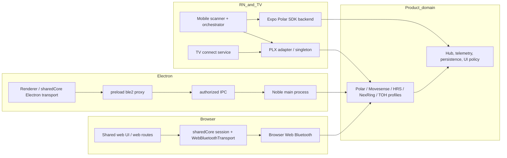

<!-- docs/audits/FIRST_CONSUMER_AUDIT.md -->

# Unified BLE 4.0 — first-consumer audit

**Audit date:** 2026-07-25
**Consumer repository:** `bun-mono`
**Library baseline examined:** `react-native-ble-plx` branch `4.0`
**Decision:** bun-mono is a migration consumer, not a source of public Unified BLE API design.

## Executive decision record

- **[Proven]** bun-mono has four live BLE host families—browser Web Bluetooth, Electron main-process Noble, React Native PLX/Polar SDK, and TV PLX—and a fifth legacy Expo host still in the workspace. Its current portability layer is `IGattTransport`, which passes `DataView`, `ArrayBufferView`, optional methods, and an opaque `handle`; it is not a viable 4.0 public contract. [`packages/sharedCore/src/bleDevices/transport/IGattTransport.ts:4-24`](../../../../bun-mono/packages/sharedCore/src/bleDevices/transport/IGattTransport.ts)

- **[Proven]** The library plan requires a clean `unified-ble-manager@4.0.0` contract that is bytes-first (`Uint8Array`), capability-led, abortable, generation-safe, bounded, backend-contract/TCK tested, and has no Noble fallback or product policy. [`docs/UNIFIED_BLE_4.0_IMPLEMENTATION_PLAN.md §2, §5, §8, §13, §18, §22`](../UNIFIED_BLE_4.0_IMPLEMENTATION_PLAN.md)

- **[Proven]** The existing vendor profiles are not transport implementations: Polar PMD/PSFTP, Movesense GSP/MDS, HRS parsing, NexRing, Track Our Health watch protocol, telemetry, device registration, time alignment, recording, and clinical-domain logic are bun-mono-owned. For example, Polar's manager imports PMD, PSFTP, telemetry, alignment, device information, and an app command queue in one profile implementation. [`packages/sharedCore/src/bleDevices/vendors/polar/deviceManager.ts:1-55`](../../../../bun-mono/packages/sharedCore/src/bleDevices/vendors/polar/deviceManager.ts)

- **[Proven]** Therefore the migration is a **replacement of generic transport ownership**, not a move of Track Our Health vendor profiles into the OSS library. The consumer must rebuild profile composition roots against Unified BLE 4.0 and delete the old generic stack; it must not retain an adapter, compatibility path, or Noble fallback. [`docs/UNIFIED_BLE_4.0_IMPLEMENTATION_PLAN.md §22.1-§22.4`](../UNIFIED_BLE_4.0_IMPLEMENTATION_PLAN.md)

## Method and completeness evidence

- **[Proven]** I read the library instructions and the complete Unified BLE 4.0 plan, plus the bun-mono root instructions, the shared BLE instructions and mandatory stack/adapter documents, and the Electron, web, TV, mobile, legacy Expo, shared web UI, shared biometrics, and Expo Polar nested instructions. The active root pair is identical. [`AGENTS.md`](../../../../bun-mono/AGENTS.md), [`CLAUDE.md`](../../../../bun-mono/CLAUDE.md), [`packages/sharedCore/src/bleDevices/STACK.md`](../../../../bun-mono/packages/sharedCore/src/bleDevices/STACK.md), [`packages/sharedCore/src/bleDevices/ADAPTERS.md`](../../../../bun-mono/packages/sharedCore/src/bleDevices/ADAPTERS.md)

- **[Proven]** Repository discovery searched all `apps/**` and `packages/**` TypeScript/JavaScript/package files for `react-native-ble-plx`, Noble, `navigator.bluetooth`, `requestDevice`, `IGattTransport`, `WebBluetoothTransport`, `NobleTransport`, `BleManager(`, and Electron `ble2` channels. It produced 126 direct consumer/config/test references; the source inventory below records the actionable groups and explicitly separates archived/outside-workspace material.

- **[Proven]** This is static evidence only. No physical peripheral, browser chooser, Android/iOS device, TV, Quest, Electron packaging, or native adapter run was performed as part of an audit document. Claims about runtime success are consequently marked **Missing Evidence**, not inferred from tests or comments.

- **[Proven]** The library worktree was already materially dirty before this audit, including `.claude/settings.local.json`, library source, docs, and test changes. I did not modify any of them. The bun-mono worktree already had a modified `pnpm-lock.yaml` and an untracked `Documentation/BOT_FINDING_PREVENTION_PLAYBOOK.md`; neither was touched.

## Consumer and source inventory

**[Proven]** Every inventory row below is based on a direct repository citation in its evidence cell. The listed migration action is the corresponding 4.0 plan disposition, not a claim that the deletion has already occurred.

| Consumer surface | Current owner / entry points | 4.0 action | Evidence |
|---|---|---|---|
| Shared transport contract | `IGattTransport`, `common/types`, `errors`, `queue`, `hub`, `session/connect`, and `transport/{webbluetooth,noble,electron}` | **Delete/retire as generic transport.** Preserve only app-level profile composition after it is rebuilt on the 4.0 manager. | **[Proven]** [`packages/sharedCore/src/bleDevices/transport/IGattTransport.ts:4-24`](../../../../bun-mono/packages/sharedCore/src/bleDevices/transport/IGattTransport.ts), [`packages/sharedCore/src/bleDevices/hub.ts`](../../../../bun-mono/packages/sharedCore/src/bleDevices/hub.ts), [`packages/sharedCore/src/bleDevices/session/connect.ts`](../../../../bun-mono/packages/sharedCore/src/bleDevices/session/connect.ts) |
| Browser web | Shared overlay/session, live Polar session, live Movesense session, tests/demo pages | Replace direct shared-core Web Bluetooth construction with `unified-ble-manager/web`; leave UI/device/profile choice in bun-mono. | **[Proven]** [`packages/sharedWebUI/src/components/connect/ConnectDeviceOverlay.tsx:16-17`](../../../../bun-mono/packages/sharedWebUI/src/components/connect/ConnectDeviceOverlay.tsx), [`apps/web-trackourhearts/src/app/demo/live-polar/state/deviceSession.ts:11-13`](../../../../bun-mono/apps/web-trackourhearts/src/app/demo/live-polar/state/deviceSession.ts), [`apps/web-trackourhearts/src/app/demo/live-polar/state/movesenseSession.ts:6`](../../../../bun-mono/apps/web-trackourhearts/src/app/demo/live-polar/state/movesenseSession.ts) |
| Electron | Preload `ble2`, validated legacy `ble:*`, IPC transport, Noble main, renderer scanner/test pages, harness | Replace `ble2` with the versioned 4.0 Electron renderer/main proxy; eliminate Noble and the parallel legacy bridge. | **[Proven]** [`apps/electron-desktop/src/preload/index.ts:169-343`](../../../../bun-mono/apps/electron-desktop/src/preload/index.ts), [`apps/electron-desktop/src/main/ipc-transport.ts:59-181`](../../../../bun-mono/apps/electron-desktop/src/main/ipc-transport.ts), [`apps/electron-desktop/src/main/noble-gatt-main.ts`](../../../../bun-mono/apps/electron-desktop/src/main/noble-gatt-main.ts) |
| React Native mobile | Scanner + PLX singleton, `ConnectOrchestrator`, HRS/Movesense PLX backends, direct Expo Polar backend, restoration | Use `unified-ble-manager/react-native` at one mobile composition root. Preserve Polar SDK as a bun-mono vendor/profile integration, not a UBM backend or capability source. | **[Proven]** [`apps/mobile-trackourhearts/src/features/device-connect/connectOrchestrator.ts:22-35`](../../../../bun-mono/apps/mobile-trackourhearts/src/features/device-connect/connectOrchestrator.ts), [`apps/mobile-trackourhearts/src/features/device-connect/plx/createPlxTransport.ts:1-15`](../../../../bun-mono/apps/mobile-trackourhearts/src/features/device-connect/plx/createPlxTransport.ts), [`apps/mobile-trackourhearts/src/features/device-connect/polar/ExpoPolarBackend.ts:20-70`](../../../../bun-mono/apps/mobile-trackourhearts/src/features/device-connect/polar/ExpoPolarBackend.ts) |
| TV | `connectService`, scan lifecycle, Android permission flow, PLX shared manager | Use `unified-ble-manager/react-native`; retain TV UI, secure-vault persistence, vendor inference, and application stream policy outside UBM. | **[Proven]** [`apps/tv-hearts/src/ble/connectService.ts:1-33`](../../../../bun-mono/apps/tv-hearts/src/ble/connectService.ts), [`apps/tv-hearts/src/ble/connectScanLifecycle.ts:1-143`](../../../../bun-mono/apps/tv-hearts/src/ble/connectScanLifecycle.ts), [`apps/tv-hearts/src/screens/connect/connect.permissions.ts:1-22`](../../../../bun-mono/apps/tv-hearts/src/screens/connect/connect.permissions.ts) |
| Legacy Expo host | Old direct PLX scanner/manager, background task, device store, old Expo Polar module | Migrate fully or delete before 4.0 cutover; it cannot remain a PLX island. | **[Proven]** [`apps/expo-trackourhearts/package.json:1-122`](../../../../bun-mono/apps/expo-trackourhearts/package.json), [`apps/expo-trackourhearts/src/services/ble/bleManager.ts:1-89`](../../../../bun-mono/apps/expo-trackourhearts/src/services/ble/bleManager.ts), [`docs/UNIFIED_BLE_4.0_IMPLEMENTATION_PLAN.md §22.2`](../UNIFIED_BLE_4.0_IMPLEMENTATION_PLAN.md) |
| PLX package | `@packages/ble-transport-rn-plx` adapter, scan helper, Base64 utilities, PLX singleton/tests | Delete from runtime dependency graph after RN migration; its useful semantics become UBM adapter/TCK requirements, not a compatibility package. | **[Proven]** [`packages/ble-transport-rn-plx/package.json:2-24`](../../../../bun-mono/packages/ble-transport-rn-plx/package.json), [`packages/ble-transport-rn-plx/src/adapters/PlxTransport.adapter.ts:1-200`](../../../../bun-mono/packages/ble-transport-rn-plx/src/adapters/PlxTransport.adapter.ts), [`docs/UNIFIED_BLE_4.0_IMPLEMENTATION_PLAN.md §22.1`](../UNIFIED_BLE_4.0_IMPLEMENTATION_PLAN.md) |
| Legacy browser stacks | Two web study `BleDeviceService`s and `@sharedBiometricsInterface` service/adapters | Delete or explicitly migrate their application/profile needs; they must not call Web Bluetooth independently after cutover. | **[Proven]** [`apps/web-trackourhearts/src/app/studies/demo/services/BleDeviceService.ts:239-341`](../../../../bun-mono/apps/web-trackourhearts/src/app/studies/demo/services/BleDeviceService.ts), [`apps/web-trackourhearts/src/app/studies/test2/services/BleDeviceService.ts:174-275`](../../../../bun-mono/apps/web-trackourhearts/src/app/studies/test2/services/BleDeviceService.ts), [`packages/sharedBiometricsInterface/src/services/ble/BleDeviceService.ts:602-829`](../../../../bun-mono/packages/sharedBiometricsInterface/src/services/ble/BleDeviceService.ts) |
| Node Web Bluetooth fork | `@packages/webbluetooth`, SimpleBLE/native addon implementation | Remove from the 4.0 consumer graph. Search found no application package dependency/import; retain only if separately justified outside this migration. | **[Proven]** [`packages/webbluetooth/package.json:2-71`](../../../../bun-mono/packages/webbluetooth/package.json), [`packages/webbluetooth/src/bluetooth.ts:276-512`](../../../../bun-mono/packages/webbluetooth/src/bluetooth.ts), [`package.json:60`](../../../../bun-mono/package.json) |
| Non-active material | `archived/polar-sdk`, `outside-monorepo/mobile-test`, `noMono/expo-toh`, backups | Do not treat as a current host migration blocker; document separately if the owning products are revived. | **[Proven]** [`archived/polar-sdk/package.json:35`](../../../../bun-mono/archived/polar-sdk/package.json), [`outside-monorepo/mobile-test/package.json:83`](../../../../bun-mono/outside-monorepo/mobile-test/package.json), [`noMono/expo-toh/package.json:120`](../../../../bun-mono/noMono/expo-toh/package.json) |

## Runtime call-flow map

**[Proven]** The map is a static call-flow reconstruction from the cited entry points and imports; it does not assert a successful live connection.

- **[Proven]** Browser UI currently calls `connectDevice(kind)`, which selects a shared-core Web Bluetooth transport; the live Polar session separately creates/controls a `PolarDeviceManager`, and the live Movesense session directly imports `WebBluetoothTransport`. This gives at least two web compositions for the same generic transport concern. [`packages/sharedWebUI/src/components/connect/ConnectDeviceOverlay.tsx:16-17`](../../../../bun-mono/packages/sharedWebUI/src/components/connect/ConnectDeviceOverlay.tsx), [`packages/sharedCore/src/bleDevices/session/connect.ts`](../../../../bun-mono/packages/sharedCore/src/bleDevices/session/connect.ts), [`apps/web-trackourhearts/src/app/demo/live-polar/state/deviceSession.ts:11-13`](../../../../bun-mono/apps/web-trackourhearts/src/app/demo/live-polar/state/deviceSession.ts), [`apps/web-trackourhearts/src/app/demo/live-polar/state/movesenseSession.ts:6`](../../../../bun-mono/apps/web-trackourhearts/src/app/demo/live-polar/state/movesenseSession.ts)

- **[Proven]** Electron has two competing paths over the same process-global Noble driver: the renderer's `ble2` GATT proxy reaches `noble-gatt-main`, while `BleBridge` imports Noble and app product managers directly for older `ble:*` IPC. [`apps/electron-desktop/src/preload/index.ts:169-343`](../../../../bun-mono/apps/electron-desktop/src/preload/index.ts), [`apps/electron-desktop/src/main/ble-bridge.ts:1-11`](../../../../bun-mono/apps/electron-desktop/src/main/ble-bridge.ts), [`apps/electron-desktop/src/main/noble-gatt-main.ts:1-20`](../../../../bun-mono/apps/electron-desktop/src/main/noble-gatt-main.ts)

- **[Proven]** Mobile has two transport systems in the same app: PLX feeds generic HRS and Movesense managers, while Polar uses the direct Expo Polar SDK through `deviceConnectionStore`, then adapts it back into the shared `IDeviceManager` model. [`apps/mobile-trackourhearts/src/features/device-connect/hrs/HrsBackend.ts:1-41`](../../../../bun-mono/apps/mobile-trackourhearts/src/features/device-connect/hrs/HrsBackend.ts), [`apps/mobile-trackourhearts/src/features/device-connect/movesense/MovesenseBackend.ts:1-39`](../../../../bun-mono/apps/mobile-trackourhearts/src/features/device-connect/movesense/MovesenseBackend.ts), [`apps/mobile-trackourhearts/src/features/device-connect/polar/ExpoPolarBackend.ts:1-74`](../../../../bun-mono/apps/mobile-trackourhearts/src/features/device-connect/polar/ExpoPolarBackend.ts), [`apps/mobile-trackourhearts/src/features/device-connect/polar/PolarManagerAdapter.ts:1-36`](../../../../bun-mono/apps/mobile-trackourhearts/src/features/device-connect/polar/PolarManagerAdapter.ts)

- **[Proven]** TV duplicates its own scan lifecycle, ID/vendor inference, PLX transport construction, pre-connect OS-disconnect hygiene, secure-vault updates, capability probe, and a provisional Polar-to-HRS fallback. [`apps/tv-hearts/src/ble/connectService.ts:60-216`](../../../../bun-mono/apps/tv-hearts/src/ble/connectService.ts), [`apps/tv-hearts/src/ble/connectService.ts:246-389`](../../../../bun-mono/apps/tv-hearts/src/ble/connectService.ts), [`apps/tv-hearts/src/ble/connectScanLifecycle.ts:1-143`](../../../../bun-mono/apps/tv-hearts/src/ble/connectScanLifecycle.ts)

## API, byte, identity, and behavior inventory

| Concern | Current observation | Required 4.0 disposition |
|---|---|---|
| Bytes | **[Proven]** Generic transport input/output is `DataView`/`ArrayBufferView`, Electron sends `ArrayBuffer` over IPC, and PLX converts native Base64 to/from `DataView`. [`packages/sharedCore/src/bleDevices/transport/IGattTransport.ts:8-10`](../../../../bun-mono/packages/sharedCore/src/bleDevices/transport/IGattTransport.ts), [`packages/sharedCore/src/bleDevices/transport/electron.ts:123-173`](../../../../bun-mono/packages/sharedCore/src/bleDevices/transport/electron.ts), [`packages/ble-transport-rn-plx/src/adapters/PlxTransport.adapter.ts:9-14`](../../../../bun-mono/packages/ble-transport-rn-plx/src/adapters/PlxTransport.adapter.ts) | **[Proven]** UBM owns only `Uint8Array` at its public/backend boundary; Base64 is confined to the RN native bridge codec and copied at host/IPC boundaries. [`docs/UNIFIED_BLE_4.0_IMPLEMENTATION_PLAN.md §5, §8, §13`](../UNIFIED_BLE_4.0_IMPLEMENTATION_PLAN.md) |
| Byte correctness | **[Proven]** Noble reads copy a `Buffer` into an `ArrayBuffer`, but its notification teardown does not remove the listener; PLX has a separate Base64 conversion utility; Web transport produces DOM `DataView`s. [`packages/sharedCore/src/bleDevices/transport/noble.ts:120-184`](../../../../bun-mono/packages/sharedCore/src/bleDevices/transport/noble.ts), [`packages/ble-transport-rn-plx/src/utils/base64.ts`](../../../../bun-mono/packages/ble-transport-rn-plx/src/utils/base64.ts), [`packages/sharedCore/src/bleDevices/transport/webbluetooth.ts`](../../../../bun-mono/packages/sharedCore/src/bleDevices/transport/webbluetooth.ts) | **[Inferred]** TCK vectors must include non-zero byte offsets, independent ownership after an event, binary IPC serialization, Base64 exact round trips, and no mutation/reuse by the backend. |
| Device identity | **[Proven]** `DeviceRef.handle` is `unknown`; profiles and hosts use physical transport IDs then sometimes rekey to a canonical vendor ID. [`packages/sharedCore/src/bleDevices/common/types.ts`](../../../../bun-mono/packages/sharedCore/src/bleDevices/common/types.ts), [`apps/mobile-trackourhearts/src/features/device-connect/connectOrchestrator.ts:132-174`](../../../../bun-mono/apps/mobile-trackourhearts/src/features/device-connect/connectOrchestrator.ts) | **[Proven]** Public UBM handles must be opaque structured records with generation, while product canonical-ID and persistence/rekey policy remains in bun-mono. [`docs/UNIFIED_BLE_4.0_IMPLEMENTATION_PLAN.md §5, §7, §22.1`](../UNIFIED_BLE_4.0_IMPLEMENTATION_PLAN.md) |
| Capability source | **[Proven]** Capabilities are a mix of dynamic vendor probing, static mobile `DeviceTypeDetector` assumptions, TV inference/persistence, and direct Expo Polar SDK APIs. [`packages/sharedCore/src/bleDevices/vendors/polar/capabilities.ts`](../../../../bun-mono/packages/sharedCore/src/bleDevices/vendors/polar/capabilities.ts), [`apps/mobile-trackourhearts/src/services/ble/DeviceTypeDetector.ts`](../../../../bun-mono/apps/mobile-trackourhearts/src/services/ble/DeviceTypeDetector.ts), [`apps/tv-hearts/src/ble/connectVendorInference.ts:1-44`](../../../../bun-mono/apps/tv-hearts/src/ble/connectVendorInference.ts) | **[Proven]** UBM owns generic capability registry/probing. Vendor/device capabilities and the resulting clinical product decisions remain bun-mono. No static consumer matrix may be promoted into UBM. [`docs/UNIFIED_BLE_4.0_IMPLEMENTATION_PLAN.md §6, §22.1`](../UNIFIED_BLE_4.0_IMPLEMENTATION_PLAN.md) |
| Cancellation | **[Proven]** Core transport has no `AbortSignal`; PLX uses private transaction IDs/cancellation and scan cancellation completes rather than rejecting; TV adds another `AbortController` scan wrapper. [`packages/sharedCore/src/bleDevices/transport/IGattTransport.ts:4-24`](../../../../bun-mono/packages/sharedCore/src/bleDevices/transport/IGattTransport.ts), [`packages/ble-transport-rn-plx/src/adapters/PlxTransport.adapter.ts:33-61`](../../../../bun-mono/packages/ble-transport-rn-plx/src/adapters/PlxTransport.adapter.ts), [`packages/ble-transport-rn-plx/src/adapters/scan.ts:10-96`](../../../../bun-mono/packages/ble-transport-rn-plx/src/adapters/scan.ts), [`apps/tv-hearts/src/ble/connectScanLifecycle.ts:25-143`](../../../../bun-mono/apps/tv-hearts/src/ble/connectScanLifecycle.ts) | **[Proven]** UBM owns one abort/error contract and opaque operation IDs, including IPC serialization. [`docs/UNIFIED_BLE_4.0_IMPLEMENTATION_PLAN.md §5, §8, §13`](../UNIFIED_BLE_4.0_IMPLEMENTATION_PLAN.md) |
| Queues/retries/reconnect | **[Proven]** `CommandQueue`/circuit breaker live in shared core; Polar, Movesense, Electron main, TV, mobile orchestrator, and web sessions add their own serial/race/reconnect policy. [`packages/sharedCore/src/bleDevices/common/queue.ts`](../../../../bun-mono/packages/sharedCore/src/bleDevices/common/queue.ts), [`packages/sharedCore/src/bleDevices/vendors/polar/deviceManager.ts:33-34`](../../../../bun-mono/packages/sharedCore/src/bleDevices/vendors/polar/deviceManager.ts), [`apps/electron-desktop/src/main/noble-gatt-main.ts`](../../../../bun-mono/apps/electron-desktop/src/main/noble-gatt-main.ts), [`apps/mobile-trackourhearts/src/features/device-connect/connectOrchestrator.ts:37-213`](../../../../bun-mono/apps/mobile-trackourhearts/src/features/device-connect/connectOrchestrator.ts), [`apps/web-trackourhearts/src/app/demo/live-polar/state/deviceSession.ts`](../../../../bun-mono/apps/web-trackourhearts/src/app/demo/live-polar/state/deviceSession.ts) | **[Proven]** Generic per-device serialization, bounded queue/backpressure, cancellation, stale-generation rejection, and transport failure taxonomy belong in UBM. User reconnect choices, persistence, telemetry, and stream recovery remain consumer policy. [`docs/UNIFIED_BLE_4.0_IMPLEMENTATION_PLAN.md §5, §7, §22.1`](../UNIFIED_BLE_4.0_IMPLEMENTATION_PLAN.md) |
| Background/restoration | **[Proven]** Mobile config enables PLX central background/restoration, and app code also creates PLX restoration routes; the legacy Expo app independently controls restoration and background service policy. [`apps/mobile-trackourhearts/app.config.ts:104-111`](../../../../bun-mono/apps/mobile-trackourhearts/app.config.ts), [`apps/mobile-trackourhearts/src/services/ble/BleManager.ts:1-96`](../../../../bun-mono/apps/mobile-trackourhearts/src/services/ble/BleManager.ts), [`apps/mobile-trackourhearts/src/services/BleRestorationManager.ts:1-184`](../../../../bun-mono/apps/mobile-trackourhearts/src/services/BleRestorationManager.ts), [`apps/expo-trackourhearts/app.config.ts:59-215`](../../../../bun-mono/apps/expo-trackourhearts/app.config.ts) | **[Missing Evidence]** No captured restoration test proves restoration while an active UBM-style session, vendor SDK session, and foreground service are reconciled. This requires an explicit app policy and physical-device acceptance matrix. |

## Electron trust, IPC, and Noble replacement boundary

- **[Proven]** `ipc-transport` authorizes all `ble2` invocation channels with `authorizeSender`, resolves the root webContents owner, and installs crash/destroy cleanup. [`apps/electron-desktop/src/main/ipc-transport.ts:19-57`](../../../../bun-mono/apps/electron-desktop/src/main/ipc-transport.ts), [`apps/electron-desktop/src/main/ipc-transport.ts:59-181`](../../../../bun-mono/apps/electron-desktop/src/main/ipc-transport.ts), [`apps/electron-desktop/src/main/ipcSenderAuth.ts:1-86`](../../../../bun-mono/apps/electron-desktop/src/main/ipcSenderAuth.ts)

- **[Proven]** The preload exposes direct `ble:*` product manager commands **and** raw-ish `ble2` GATT/scan operations. Both are application-specific IPC surfaces that must be replaced, not wrapped, because 4.0 requires a single versioned renderer/main protocol. [`apps/electron-desktop/src/preload/index.ts:131-167`](../../../../bun-mono/apps/electron-desktop/src/preload/index.ts), [`apps/electron-desktop/src/preload/index.ts:169-343`](../../../../bun-mono/apps/electron-desktop/src/preload/index.ts), [`docs/UNIFIED_BLE_4.0_IMPLEMENTATION_PLAN.md §13, §22.2`](../UNIFIED_BLE_4.0_IMPLEMENTATION_PLAN.md)

- **[Proven]** Noble is imported by the old main bridge, Noble GATT main, and harness; package configuration also depends on `@stoprocent/noble` and the root lock/build settings explicitly carry its native dependencies. [`apps/electron-desktop/src/main/ble-bridge.ts:8-10`](../../../../bun-mono/apps/electron-desktop/src/main/ble-bridge.ts), [`apps/electron-desktop/src/main/noble-gatt-main.ts:1-5`](../../../../bun-mono/apps/electron-desktop/src/main/noble-gatt-main.ts), [`apps/electron-desktop/src/main/ble-harness.ts:9-11`](../../../../bun-mono/apps/electron-desktop/src/main/ble-harness.ts), [`apps/electron-desktop/package.json:31-50`](../../../../bun-mono/apps/electron-desktop/package.json), [`package.json:86-104`](../../../../bun-mono/package.json)

- **[Proven]** Electron main currently intentionally returns `{ ok: true, warn }` for several stop-notification failure/teardown cases; renderer transport removes its local listener before it evaluates that warning. This is a fake-success path under the 4.0 rule and cannot survive the migration. [`apps/electron-desktop/src/main/ipc-transport.ts:109-149`](../../../../bun-mono/apps/electron-desktop/src/main/ipc-transport.ts), [`packages/sharedCore/src/bleDevices/transport/electron.ts:232-270`](../../../../bun-mono/packages/sharedCore/src/bleDevices/transport/electron.ts)

- **[Proven]** Electron scan currently refuses to start while any device is connected, a product-derived scanner policy that is incompatible with a generic backend contract and must move to a consumer policy decision. [`apps/electron-desktop/src/main/noble-gatt-main.ts:1642-1660`](../../../../bun-mono/apps/electron-desktop/src/main/noble-gatt-main.ts), [`docs/UNIFIED_BLE_4.0_IMPLEMENTATION_PLAN.md §22.1`](../UNIFIED_BLE_4.0_IMPLEMENTATION_PLAN.md)

- **[Inferred]** The 4.0 Electron protocol should include schema/version negotiation, protocol-compatible error records, explicit owner/session/generation records, bounded event delivery, cancellation propagation, reload/rebind behavior, and permission/sender tests. The main process remains the only physical BLE owner; product managers may run where their product state belongs only through the proxy contract. [`docs/UNIFIED_BLE_4.0_IMPLEMENTATION_PLAN.md §13, §18`](../UNIFIED_BLE_4.0_IMPLEMENTATION_PLAN.md)

- **[Missing Evidence]** No current test artifact establishes expected renderer-reload semantics: existing cleanup forcibly disconnects on renderer termination, whereas 4.0 needs an explicit decision on preserve/rebind versus intentional disconnect. [`apps/electron-desktop/src/main/ipc-transport.ts:34-51`](../../../../bun-mono/apps/electron-desktop/src/main/ipc-transport.ts), [`apps/electron-desktop/src/main/noble-gatt-main.ts:675-728`](../../../../bun-mono/apps/electron-desktop/src/main/noble-gatt-main.ts)

## Duplicates and DRY migration pressure

| Duplicate | Evidence | Resolution |
|---|---|---|
| Scan lifecycle | **[Proven]** PLX adapter scan, mobile `BleScanner`, TV `startScanLifecycle`, Electron scan session, Web Bluetooth request flow, and two legacy browser services each control timing/cleanup. [`packages/ble-transport-rn-plx/src/adapters/scan.ts:10-96`](../../../../bun-mono/packages/ble-transport-rn-plx/src/adapters/scan.ts), [`apps/mobile-trackourhearts/src/services/ble/BleScanner.ts:1-428`](../../../../bun-mono/apps/mobile-trackourhearts/src/services/ble/BleScanner.ts), [`apps/tv-hearts/src/ble/connectScanLifecycle.ts:1-143`](../../../../bun-mono/apps/tv-hearts/src/ble/connectScanLifecycle.ts), [`apps/electron-desktop/src/main/noble-gatt-main.ts:1642-1756`](../../../../bun-mono/apps/electron-desktop/src/main/noble-gatt-main.ts) | **[Proven]** UBM owns generic scan sessions/cancellation/backpressure; applications retain UI duration/countdown/filters and persistence. [`docs/UNIFIED_BLE_4.0_IMPLEMENTATION_PLAN.md §5, §22.1`](../UNIFIED_BLE_4.0_IMPLEMENTATION_PLAN.md) |
| Generic GATT operations | **[Proven]** Web, Noble, Electron IPC, and PLX independently implement connect/read/write/notification lifecycle and error mapping. [`packages/sharedCore/src/bleDevices/transport/webbluetooth.ts`](../../../../bun-mono/packages/sharedCore/src/bleDevices/transport/webbluetooth.ts), [`packages/sharedCore/src/bleDevices/transport/noble.ts:80-240`](../../../../bun-mono/packages/sharedCore/src/bleDevices/transport/noble.ts), [`packages/sharedCore/src/bleDevices/transport/electron.ts:71-333`](../../../../bun-mono/packages/sharedCore/src/bleDevices/transport/electron.ts), [`packages/ble-transport-rn-plx/src/adapters/PlxTransport.adapter.ts:89-240`](../../../../bun-mono/packages/ble-transport-rn-plx/src/adapters/PlxTransport.adapter.ts) | **[Proven]** Replace with UBM adapters and TCK; do not port the shared-core abstraction wholesale. [`docs/UNIFIED_BLE_4.0_IMPLEMENTATION_PLAN.md §8, §18, §22.1`](../UNIFIED_BLE_4.0_IMPLEMENTATION_PLAN.md) |
| Device manager/hub | **[Proven]** `IDeviceManager` and hub bundle product device semantics, telemetry and profile operations with generic transport ownership; mobile, TV, web, Electron and shared web UI all consume it. [`packages/sharedCore/src/bleDevices/deviceManager.ts`](../../../../bun-mono/packages/sharedCore/src/bleDevices/deviceManager.ts), [`packages/sharedCore/src/bleDevices/hub.ts`](../../../../bun-mono/packages/sharedCore/src/bleDevices/hub.ts), [`packages/sharedWebUI/src/ble/ConnectAsButton.tsx`](../../../../bun-mono/packages/sharedWebUI/src/ble/ConnectAsButton.tsx) | **[Proven]** Keep/refactor it in bun-mono as a domain layer after converting its generic transport dependency to UBM; do not export it from OSS. [`docs/UNIFIED_BLE_4.0_IMPLEMENTATION_PLAN.md §22.1`](../UNIFIED_BLE_4.0_IMPLEMENTATION_PLAN.md) |
| Device identification | **[Proven]** Mobile static detector, scan profiles, TV vendor inference, web tests, and legacy services make product/device assumptions from names/services/manufacturer data. [`apps/mobile-trackourhearts/src/services/ble/DeviceTypeDetector.ts`](../../../../bun-mono/apps/mobile-trackourhearts/src/services/ble/DeviceTypeDetector.ts), [`apps/mobile-trackourhearts/src/features/device-scan/scanProfiles.ts:1-208`](../../../../bun-mono/apps/mobile-trackourhearts/src/features/device-scan/scanProfiles.ts), [`apps/tv-hearts/src/ble/connectVendorInference.ts:1-44`](../../../../bun-mono/apps/tv-hearts/src/ble/connectVendorInference.ts) | **[Proven]** Keep as bun-mono profile-selection policy. UBM sees generic advertised metadata/capabilities only. [`docs/UNIFIED_BLE_4.0_IMPLEMENTATION_PLAN.md §6, §22.1`](../UNIFIED_BLE_4.0_IMPLEMENTATION_PLAN.md) |

## Existing code-quality and safety findings

| Severity | Finding | Evidence | Required disposition |
|---|---|---|---|
| Critical | **[Proven]** The current Noble generic transport silently turns service/characteristic discovery failures into `[]`, uses multiple `as any` values, and treats no-response writes as complete before callback failure can surface. [`packages/sharedCore/src/bleDevices/transport/noble.ts:137-157`](../../../../bun-mono/packages/sharedCore/src/bleDevices/transport/noble.ts), [`packages/sharedCore/src/bleDevices/transport/noble.ts:197-224`](../../../../bun-mono/packages/sharedCore/src/bleDevices/transport/noble.ts) | Build the 4.0 owned backend; do not port these semantics. |
| Critical | **[Proven]** The old Electron generic transport contains empty catches and `any` error/context parameters, and returns a no-op disconnect subscription if capability is absent. [`packages/sharedCore/src/bleDevices/transport/electron.ts:36-51`](../../../../bun-mono/packages/sharedCore/src/bleDevices/transport/electron.ts), [`packages/sharedCore/src/bleDevices/transport/electron.ts:280-333`](../../../../bun-mono/packages/sharedCore/src/bleDevices/transport/electron.ts) | Delete during backend cutover; 4.0 must use typed errors and explicit unsupported behavior. |
| Critical | **[Proven]** `TohWearManager` has numerous forbidden `as any` casts and empty catches around connection, notifications, state, capability, and cleanup paths. [`packages/sharedCore/src/bleDevices/vendors/toh/deviceManager.ts:82-214`](../../../../bun-mono/packages/sharedCore/src/bleDevices/vendors/toh/deviceManager.ts), [`packages/sharedCore/src/bleDevices/vendors/toh/deviceManager.ts:437-537`](../../../../bun-mono/packages/sharedCore/src/bleDevices/vendors/toh/deviceManager.ts) | It is a bun-mono profile, but it cannot be migrated as-is. Create a separate product hardening work package before connecting it to UBM. |
| High | **[Proven]** PLX maps native `OperationCancelled` to `Busy`, mixes bridge transaction IDs into transport behavior, and returns successful completion on scan abort. [`packages/ble-transport-rn-plx/src/adapters/PlxTransport.adapter.ts:104-173`](../../../../bun-mono/packages/ble-transport-rn-plx/src/adapters/PlxTransport.adapter.ts), [`packages/ble-transport-rn-plx/src/adapters/scan.ts:63-69`](../../../../bun-mono/packages/ble-transport-rn-plx/src/adapters/scan.ts) | Specify/implement one UBM cancellation taxonomy and test it across hosts. |
| High | **[Proven]** Mobile restoration diagnostics instantiate a temporary second `BleManager`, while the app has a singleton manager with a restoration callback. [`apps/mobile-trackourhearts/src/services/ble/BleManager.ts:31-96`](../../../../bun-mono/apps/mobile-trackourhearts/src/services/ble/BleManager.ts), [`apps/mobile-trackourhearts/src/services/BleRestorationManager.ts:46-80`](../../../../bun-mono/apps/mobile-trackourhearts/src/services/BleRestorationManager.ts) | Resolve ownership as part of the RN composition-root migration; no second physical central manager. |
| High | **[Proven]** Legacy study/shared biometrics services call Web Bluetooth directly and intentionally suppress several setup failures with `.catch(() => {})`. [`packages/sharedBiometricsInterface/src/services/ble/BleDeviceService.ts:814-829`](../../../../bun-mono/packages/sharedBiometricsInterface/src/services/ble/BleDeviceService.ts), [`apps/web-trackourhearts/src/app/studies/demo/services/BleDeviceService.ts:334-341`](../../../../bun-mono/apps/web-trackourhearts/src/app/studies/demo/services/BleDeviceService.ts) | Delete or migrate as a bounded product use case; do not let them remain direct transport clients. |
| High | **[Proven]** TV treats unknown devices by trying Polar then falling back to HRS; that is product selection logic and is not permitted as an implicit UBM compatibility/fallback behavior. [`apps/tv-hearts/src/ble/connectService.ts:181-198`](../../../../bun-mono/apps/tv-hearts/src/ble/connectService.ts), [`apps/tv-hearts/src/ble/connectService.ts:325-345`](../../../../bun-mono/apps/tv-hearts/src/ble/connectService.ts) | Keep only if product explicitly elects it, with visible diagnostics; UBM must never implement it. |
| Medium | **[Proven]** Mobile static capability guesses mark many device-family features based on advertising/name rules, whereas actual Polar manager capabilities are runtime-probed. [`apps/mobile-trackourhearts/src/services/ble/DeviceTypeDetector.ts`](../../../../bun-mono/apps/mobile-trackourhearts/src/services/ble/DeviceTypeDetector.ts), [`packages/sharedCore/src/bleDevices/vendors/polar/capabilities.ts`](../../../../bun-mono/packages/sharedCore/src/bleDevices/vendors/polar/capabilities.ts) | Keep static values only as UI discovery hints; gate operations on runtime capability results. |
| Medium | **[Proven]** The `@packages/webbluetooth` Node fork contains `as any` advertisement/device property accesses and raw adapter scanning, but current package search found no consuming application dependency. [`packages/webbluetooth/src/bluetooth.ts:432-512`](../../../../bun-mono/packages/webbluetooth/src/bluetooth.ts), [`packages/webbluetooth/package.json:2-71`](../../../../bun-mono/packages/webbluetooth/package.json) | Remove it from this migration's runtime/install surface unless a separately owned Node host proves a need. |

## Package, build, test, and CI evidence

- **[Proven]** Root pnpm overrides every in-workspace PLX consumer to `@sfourdrinier/react-native-ble-plx@3.8.2`; mobile, TV, legacy Expo and the PLX adapter declare that package, while Electron declares Noble. [`package.json:24-104`](../../../../bun-mono/package.json), [`apps/mobile-trackourhearts/package.json:69-138`](../../../../bun-mono/apps/mobile-trackourhearts/package.json), [`apps/tv-hearts/package.json:78-115`](../../../../bun-mono/apps/tv-hearts/package.json), [`apps/expo-trackourhearts/package.json:1-122`](../../../../bun-mono/apps/expo-trackourhearts/package.json), [`apps/electron-desktop/package.json:28-50`](../../../../bun-mono/apps/electron-desktop/package.json)

- **[Proven]** The lockfile resolves PLX for all three native consumers and Noble for Electron. [`pnpm-lock.yaml:633`](../../../../bun-mono/pnpm-lock.yaml), [`pnpm-lock.yaml:907-909`](../../../../bun-mono/pnpm-lock.yaml), [`pnpm-lock.yaml:1935-1937`](../../../../bun-mono/pnpm-lock.yaml), [`pnpm-lock.yaml:2288-2290`](../../../../bun-mono/pnpm-lock.yaml), [`pnpm-lock.yaml:11811`](../../../../bun-mono/pnpm-lock.yaml)

- **[Proven]** Existing focused tests exist for shared-core transport/contracts, PLX, Electron scan filters/renderer IPC, TV scan/vendor logic, mobile connect orchestration, and vendor profile paths. They are useful regression evidence but do not form a cross-backend UBM TCK. [`packages/sharedCore/src/bleDevices/__tests__/transport-contract.test.ts`](../../../../bun-mono/packages/sharedCore/src/bleDevices/__tests__/transport-contract.test.ts), [`packages/ble-transport-rn-plx/src/adapters/__tests__/PlxTransport.adapter.test.ts`](../../../../bun-mono/packages/ble-transport-rn-plx/src/adapters/__tests__/PlxTransport.adapter.test.ts), [`apps/mobile-trackourhearts/src/features/device-connect/__tests__/connectOrchestrator.test.ts:1-117`](../../../../bun-mono/apps/mobile-trackourhearts/src/features/device-connect/__tests__/connectOrchestrator.test.ts), [`apps/tv-hearts/src/ble/__tests__/connectScanLifecycle.test.ts`](../../../../bun-mono/apps/tv-hearts/src/ble/__tests__/connectScanLifecycle.test.ts), [`apps/electron-desktop/src/renderer/platform/rendererIpcKernel.test.ts`](../../../../bun-mono/apps/electron-desktop/src/renderer/platform/rendererIpcKernel.test.ts)

- **[Missing Evidence]** No CI workflow found in this audit establishes all required UBM host/TCK scenarios: browser permission/chooser, native cancellation/restoration, Electron main/renderer reload/security, BlueZ/CoreBluetooth/WinRT, Quest Live Preview, byte-offset serialization, bounded queue, or deterministic virtual peripheral validation. The Electron release workflow packages the app but is not that contract test matrix. [` .github/workflows/electron-desktop-release.yml`](../../../../bun-mono/.github/workflows/electron-desktop-release.yml), [`docs/UNIFIED_BLE_4.0_IMPLEMENTATION_PLAN.md §18-§20`](../UNIFIED_BLE_4.0_IMPLEMENTATION_PLAN.md)

- **[Proven]** Native configuration is a migration input: mobile enables PLX background central/restoration, TV declares Bluetooth permissions and a PLX config plugin, legacy Expo declares PLX, Expo Polar, background tasks, foreground service, and restoration-related policy, and Electron declares macOS Bluetooth entitlement text. [`apps/mobile-trackourhearts/app.config.ts:60-111`](../../../../bun-mono/apps/mobile-trackourhearts/app.config.ts), [`apps/tv-hearts/app.config.ts:57-80`](../../../../bun-mono/apps/tv-hearts/app.config.ts), [`apps/tv-hearts/app.config.ts:147-151`](../../../../bun-mono/apps/tv-hearts/app.config.ts), [`apps/expo-trackourhearts/app.config.ts:59-215`](../../../../bun-mono/apps/expo-trackourhearts/app.config.ts), [`apps/electron-desktop/package.json:127-133`](../../../../bun-mono/apps/electron-desktop/package.json)

## Dependency-driven migration order

1. **[Proven] Contract and TCK gate first.** Land UBM’s bytes/capabilities/error/abort/generation/queue contracts and deterministic adapter TCK before changing a consumer. This is the plan’s prerequisite for first-consumer cutover. [`docs/UNIFIED_BLE_4.0_IMPLEMENTATION_PLAN.md §5, §18, §22.3`](../UNIFIED_BLE_4.0_IMPLEMENTATION_PLAN.md)

2. **[Proven] Owned backend gate second.** Complete the replacement Node/Electron physical backend and renderer/main protocol before any Electron product caller moves; remove Noble rather than retaining it as a fallback. [`docs/UNIFIED_BLE_4.0_IMPLEMENTATION_PLAN.md §13, §22.2`](../UNIFIED_BLE_4.0_IMPLEMENTATION_PLAN.md)

3. **[Proven] Introduce bun-mono composition roots third.** Create one web root, one Electron renderer root, one Electron main host, one RN root, and one TV root that construct UBM. Profiles receive only the UBM manager/client they need. The old `IGattTransport` must not bridge this boundary. [`docs/UNIFIED_BLE_4.0_IMPLEMENTATION_PLAN.md §22.1-§22.2`](../UNIFIED_BLE_4.0_IMPLEMENTATION_PLAN.md)

4. **[Proven] Rebuild app profiles and policy fourth.** Convert Polar, Movesense, HRS, NexRing, and TOH device protocol code to their own bun-mono API layered on UBM bytes/capabilities. Keep scan choice, reconnection, persistence, telemetry, background and health-specific policy in the app/domain layer. [`packages/sharedCore/src/bleDevices/vendors/polar/deviceManager.ts:1-55`](../../../../bun-mono/packages/sharedCore/src/bleDevices/vendors/polar/deviceManager.ts), [`packages/sharedCore/src/bleDevices/vendors/movesense/deviceManager.ts:1-50`](../../../../bun-mono/packages/sharedCore/src/bleDevices/vendors/movesense/deviceManager.ts), [`docs/UNIFIED_BLE_4.0_IMPLEMENTATION_PLAN.md §22.1`](../UNIFIED_BLE_4.0_IMPLEMENTATION_PLAN.md)

5. **[Proven] Migrate host applications fifth.** Web can move after the web adapter TCK; mobile/TV after the RN adapter and restoration composition decision; Electron after the main proxy contract; legacy Expo must migrate or be deleted in the same release train. [`docs/UNIFIED_BLE_4.0_IMPLEMENTATION_PLAN.md §22.2-§22.3`](../UNIFIED_BLE_4.0_IMPLEMENTATION_PLAN.md)

6. **[Proven] Delete and enforce last.** Remove shared-core transports, PLX package, Noble, old Electron channels, direct Web Bluetooth services, duplicate scan helpers, old plugin/config usage, lockfile entries, and stale documentation; add repository checks preventing direct old imports. A greenfield cutover has no compatibility shim stage. [`docs/UNIFIED_BLE_4.0_IMPLEMENTATION_PLAN.md §22.4`](../UNIFIED_BLE_4.0_IMPLEMENTATION_PLAN.md)

## File migration ledger

**[Proven]** Every ledger entry is a concrete migration classification for the named file(s); wildcard entries enumerate a bounded, named responsibility directory rather than an unexamined repository-wide pattern. The source inventory above and the direct-reference search described in the method cover the remaining tests, examples, declaration files, and configuration references associated with those responsibility directories.

| Files | Current role | Owner after cutover | Action |
|---|---|---|---|
| `packages/sharedCore/src/bleDevices/transport/IGattTransport.ts`, `webbluetooth.ts`, `noble.ts`, `electron.ts`, `common/{types,errors,queue}.ts` | Generic transport abstraction/adapters | UBM | **Delete** from bun-mono generic runtime; replace callers with UBM. |
| `packages/sharedCore/src/bleDevices/session/{connect,activeSession}.ts`, `hub.ts`, `deviceManager.ts`, `index.ts` | Product session/hub and broad BLE export surface | bun-mono | **Refactor** to depend on UBM or split into product profile services; remove raw transport ownership. |
| `packages/ble-transport-rn-plx/src/**`, `packages/ble-transport-rn-plx/package.json` | PLX bridge, scan, Base64 codec, tests | UBM RN backend/codec, then none in bun-mono | **Delete** package after behavior has TCK coverage. |
| `apps/electron-desktop/src/main/{noble-gatt-main,ble-bridge,ble-harness}.ts`, `ipc-transport.ts`, preload `ble2`/`ble` sections | Noble physical host, two IPC APIs, harness | UBM Electron host/proxy | **Replace then delete** Noble/legacy bridge/channels/harness. |
| Electron renderer scanner/test pages, `ElectronHubBootstrap.tsx`, `useBleManager.ts`, shared IPC/type declarations | Renderer integration of current generic stack | bun-mono UI + UBM Electron renderer client | **Rewrite imports/contracts**; retain only product UI behavior. |
| `apps/mobile-trackourhearts/src/services/ble/{BleManager,BleScanner,DeviceTypeDetector,errors,types}.ts`, `features/device-scan/**`, `features/device-connect/{connectOrchestrator,hrs,movesense,plx}/**` | PLX lifecycle, scan, policy and profile assembly | UBM RN core plus bun-mono profile/UI policy | **Replace generic PLX lifecycle**, keep/rework profile selection and UI capability hints. |
| `apps/mobile-trackourhearts/src/features/device-connect/polar/{ExpoPolarBackend,PolarManagerAdapter}.ts`, `modules/expo-polar/**` | Polar SDK profile / native extension | bun-mono | **Preserve and harden as vendor integration**; do not move to OSS. Decide one physical-central ownership with UBM. |
| `apps/mobile-trackourhearts/src/services/BleRestorationManager.ts`, `app.config.ts` | App background/restoration policy | bun-mono app | **Redesign against UBM RN lifecycle** with physical-device tests. |
| `apps/tv-hearts/src/ble/**`, `screens/connect/**`, `app.config.ts` | TV UI, scan policy, vendor inference, PLX integration | bun-mono UI/policy + UBM RN | **Replace PLX use**, retain explicitly approved vendor policy only. |
| `apps/web-trackourhearts/src/app/demo/live-polar/{state,services}/**`, `packages/sharedWebUI/src/{ble,components/connect,sharedPages,device-session}/**` | Web composition, demo sessions, UI controls | bun-mono UI/profile layer + UBM web | **Rewrite composition**, preserve UI/profile logic, no direct transport imports. |
| `apps/web-trackourhearts/src/app/studies/{demo,test2}/services/BleDeviceService.ts`, `packages/sharedBiometricsInterface/src/{services/ble,adapters}/**` | Legacy direct browser BLE stacks | bun-mono only if product owner needs them | **Delete or fully migrate**; no direct browser path remains. |
| `apps/expo-trackourhearts/**` active source/config (not `*.backup`, `android.old`, `modules.Backup`) | Legacy direct PLX + Expo Polar + background host | bun-mono or deletion | **Migrate completely or delete** before enforcement. |
| `packages/webbluetooth/**`, root `onlyBuiltDependencies` entry | Unused Node/SimpleBLE Web Bluetooth fork | None for UBM cutover | **Remove** unless a separate active Node consumer is proven. |
| `package.json`, `pnpm-lock.yaml`, targeted app package/config files, Electron release/docs | Dependency/plugin/build/documentation surface | bun-mono | **Update in deletion gate**; verify no PLX/Noble/old transport remains. |

## Explicit ownership boundary

| Unified BLE 4.0 owns | bun-mono owns |
|---|---|
| **[Proven]** Manager contract; byte ownership/codec boundary; generic discovery/session/GATT/notification mechanics; capability registry semantics; typed errors; abort/operation IDs; per-device generations/queues/backpressure; host adapters; Electron main/renderer serialization/security primitives; TCK/fakes/deterministic test harness. [`docs/UNIFIED_BLE_4.0_IMPLEMENTATION_PLAN.md §5-§18`](../UNIFIED_BLE_4.0_IMPLEMENTATION_PLAN.md) | **[Proven]** Polar PMD/PSFTP, Movesense GSP/MDS, HRS parsing, NexRing/TOH protocols; device-family selection; clinical metrics/telemetry/time alignment; user reconnect/persistence/default device policy; background product behavior; UX; profile-specific recording and provisioning; vendor SDK integration. [`packages/sharedCore/src/bleDevices/vendors/polar/deviceManager.ts:1-55`](../../../../bun-mono/packages/sharedCore/src/bleDevices/vendors/polar/deviceManager.ts), [`packages/sharedCore/src/bleDevices/vendors/movesense/gspClient.ts`](../../../../bun-mono/packages/sharedCore/src/bleDevices/vendors/movesense/gspClient.ts), [`apps/mobile-trackourhearts/src/features/device-connect/connectOrchestrator.ts:219-262`](../../../../bun-mono/apps/mobile-trackourhearts/src/features/device-connect/connectOrchestrator.ts) |

## Open decisions requiring proof before implementation

1. **[Missing Evidence] RN Polar ownership:** Does the Expo Polar SDK create/use an independent BLE central that can coexist safely with the UBM RN backend, or must Polar remain a profile-only host outside the UBM physical-central path? Prove with iOS and Android live tests, restoration behavior, Bluetooth-off/on, and concurrent HRS/Movesense sessions. [`apps/mobile-trackourhearts/src/features/device-connect/polar/ExpoPolarBackend.ts:20-70`](../../../../bun-mono/apps/mobile-trackourhearts/src/features/device-connect/polar/ExpoPolarBackend.ts), [`apps/mobile-trackourhearts/src/services/ble/BleManager.ts:31-96`](../../../../bun-mono/apps/mobile-trackourhearts/src/services/ble/BleManager.ts)

2. **[Missing Evidence] Electron reload policy:** Should a renderer reload preserve a main-owned BLE session and rebind its event stream, or intentionally disconnect it? Current code disconnects on owner destruction; product requirements, user consent and data-integrity impact are not captured. [`apps/electron-desktop/src/main/ipc-transport.ts:34-51`](../../../../bun-mono/apps/electron-desktop/src/main/ipc-transport.ts), [`apps/electron-desktop/src/main/noble-gatt-main.ts:675-728`](../../../../bun-mono/apps/electron-desktop/src/main/noble-gatt-main.ts)

3. **[Missing Evidence] Scan-with-connection policy:** Which bun-mono applications need scanning while connected? Electron forbids it today, but RN/web behavior differs. Decide at the product layer after validating adapter capability and radio contention; do not encode it in UBM. [`apps/electron-desktop/src/main/noble-gatt-main.ts:1642-1660`](../../../../bun-mono/apps/electron-desktop/src/main/noble-gatt-main.ts), [`apps/tv-hearts/src/ble/connectService.ts:246-288`](../../../../bun-mono/apps/tv-hearts/src/ble/connectService.ts)

4. **[Missing Evidence] Quest Live Preview:** No bun-mono consumer proves the planned Quest Live Preview path against the 4.0 contract. Add it as a first-class acceptance scenario rather than extrapolating from browser or Android TV behavior. [`docs/UNIFIED_BLE_4.0_IMPLEMENTATION_PLAN.md §18-§20`](../UNIFIED_BLE_4.0_IMPLEMENTATION_PLAN.md)

5. **[Missing Evidence] Legacy host disposition:** `apps/expo-trackourhearts`, legacy web studies, shared biometrics direct BLE, and `@packages/webbluetooth` need named product owners to choose deletion versus full migration. The 4.0 plan prohibits leaving old host islands or compatibility paths. [`docs/UNIFIED_BLE_4.0_IMPLEMENTATION_PLAN.md §22.2-§22.4`](../UNIFIED_BLE_4.0_IMPLEMENTATION_PLAN.md)

6. **[Missing Evidence] Clinical profile acceptance:** No evidence links every product stream/recording/time-alignment requirement to UBM contract scenarios. Before profile cutover, create a product acceptance matrix that names data type, vendor model/firmware, platform, background state, cancellation path, and expected failure behavior. [`packages/sharedCore/src/bleDevices/vendors/polar/deviceManager.ts`](../../../../bun-mono/packages/sharedCore/src/bleDevices/vendors/polar/deviceManager.ts), [`packages/sharedCore/src/bleDevices/vendors/movesense/deviceManager.ts`](../../../../bun-mono/packages/sharedCore/src/bleDevices/vendors/movesense/deviceManager.ts)

## Audit validation

- **[Tested]** The audit file was created as the only file changed by this audit agent. Validation required by the assignment is `git diff --check -- docs/audits/FIRST_CONSUMER_AUDIT.md` from the library worktree.

- **[Missing Evidence]** This documentation-only audit does not certify a build, native package, BLE peripheral test, clinical validation, or a completed migration. Those outcomes require the implementation gates and validation suites described above.
