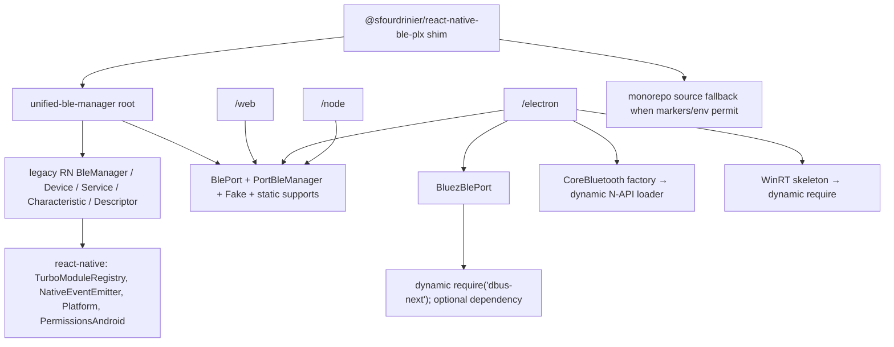

<!-- docs/audits/HOST_BACKEND_PACKAGE_AUDIT.md -->

# UB4-AUDIT-HOSTS — Host, backend, and package-isolation audit

**Audit date:** 2026-07-25
**Repository state:** branch `4.0`; current source is a transitional characterization input, not a v1 backend-contract implementation.
**Controlling authority:** [`../UNIFIED_BLE_4.0_IMPLEMENTATION_PLAN.md`](../UNIFIED_BLE_4.0_IMPLEMENTATION_PLAN.md).
**Scope:** all non-React-Native host paths, the shared port/manager and capability layer that those paths use, package/export/loading behavior, examples, tests, CI/proof scripts, and host-facing documentation. RN records are used only as the required rich-data comparison input.

## 1. Decision summary

The repository has useful implementation evidence, but none of the non-RN paths is a conforming 4.0 backend as defined by the controlling plan.

| Finding | Evidence | 4.0 consequence |
| --- | --- | --- |
| The present contract is `BlePort` plus `PortBleManager`, not the versioned component/feature contract. | [`src/port/BlePort.ts`](../../src/port/BlePort.ts) lines 12-85 and [`src/port/PortBleManager.ts`](../../src/port/PortBleManager.ts) lines 34-631. | It duplicates core policy, requires Base64 and bytes APIs, has optional capability methods discovered by casts, and cannot supply versions, typed features, generation-bound paths, normalized events, or cancellation handles. |
| Web Bluetooth is a real chooser/GATT implementation with good local error and copy handling, but it is intentionally not a scanner and is incomplete for descriptor, lifecycle, version, stream, and rich-advertisement semantics. | [`src/hosts/web.ts`](../../src/hosts/web.ts) lines 329-920; [`docs/WEB.md`](../WEB.md). | Rebuild as `web` backend plus chooser feature; do not translate `requestDevice` into a scan session. |
| BlueZ is a partial D-Bus adapter, not an ObjectManager-driven BlueZ backend. Its live path has discovery and read fallbacks that can turn a D-Bus failure into cached/test data. | [`src/hosts/native/bluez/BluezBlePort.ts`](../../src/hosts/native/bluez/BluezBlePort.ts) lines 120-430. | It is characterization and mock-probe material only; eliminate injected/cache fallbacks from the production backend. |
| The macOS CoreBluetooth addon contains a real non-Noble central vertical slice and shared Node/Electron source, but it has first-UUID-wins GATT identity, no descriptors or Services Changed, unbounded N-API event queues, no cancellation protocol, and incomplete destruction. | [`native/electron/corebluetooth/src/addon.mm`](../../native/electron/corebluetooth/src/addon.mm) lines 1-1240 and [`native/electron/corebluetooth/index.js`](../../native/electron/corebluetooth/index.js) lines 1-319. | Preserve it as the radio characterization source, then reimplement behind one CoreBluetooth backend and explicit Node/Electron factories. |
| Electron exposes only one main-oriented manager subpath; the sample has bespoke IPC rather than the required versioned main/renderer protocol. | [`src/hosts/electron.ts`](../../src/hosts/electron.ts) lines 1-293; [`example-electron/main.js`](../../example-electron/main.js) and [`example-electron/preload.js`](../../example-electron/preload.js). | Introduce separate `electron/main` and `electron/renderer` subpaths, a versioned handshake, sender/resource authorization, bounded streams, and reload reconstruction. |
| Node defaults to `FakeBlePort`; WinRT defaults to or permits Fake fallback unless `requireNative` is set. | [`src/hosts/node.ts`](../../src/hosts/node.ts) lines 11-36; [`src/hosts/native/winrt/WinRtBlePort.ts`](../../src/hosts/native/winrt/WinRtBlePort.ts) lines 1-40. | No host factory may report a usable radio or a 4.0 capability merely because a fake is available. WinRT has no production implementation or proof. |
| The root import is React-Native-coupled and the package is not host-isolated. | [`src/index.ts`](../../src/index.ts) lines 20-59; [`src/BleManager.ts`](../../src/BleManager.ts) line 28; [`src/BleModule.ts`](../../src/BleModule.ts) line 1; [`src/NativeBlePlx.ts`](../../src/NativeBlePlx.ts) lines 1-2; [`package.json`](../../package.json) lines 236-270. | The root cannot meet the framework-neutral import law. Strict host subpaths, installation tests with unrelated peers absent, and a new root surface are prerequisites to `G2`/`G5`. |
| Noble is absent from current runtime code and lockfile, but evidence is not machine-readable. | `rg` over `package.json`, `pnpm-lock.yaml`, `src`, `native`, `packages`, examples, scripts, and workflows found no runtime/dependency Noble reference; the plan records previous non-Noble macOS/Linux exercise in §5.5. | Do not add a Noble fallback. Capture the existing proof with artifact digests, OS/hardware/peripheral metadata, commands, and results before migration; rerun it through the new core before deletion. |

The highest-risk implementation defects for the replacement design are: (1) BlueZ's cache/injected-device fallbacks on real-operation errors, (2) CoreBluetooth's UUID-only pending-operation and GATT lookup keys, (3) unbounded N-API callback queues, (4) `PortBleManager.destroy()` not owning backend destruction, and (5) the absence of Electron renderer lifecycle/resource authorization semantics.

## 2. Audit method and source inventory

### 2.1 Method

This audit read the complete controlling plan and the listed implementation, test, script, package, example, and documentation files. Assertions below distinguish source inspection from execution evidence. No roadmap status alone is treated as proof.

The current source was searched for host imports, dynamic loads, `FakeBlePort`, Noble, Base64, optional-method probes, casts, fallback branches, `destroy`, cancellation, descriptor, MTU/RSSI, Services Changed, D-Bus ObjectManager/signals, and Electron IPC paths. Current local modifications outside this report were not inspected as task inputs or changed.

### 2.2 Implementation and package sources inspected

| Area | Sources inspected | What they establish |
| --- | --- | --- |
| Transitional contract/core | `src/port/BlePort.ts`, `src/port/PortBleManager.ts`, `src/DeviceOperationQueue.ts`, `src/longWrite.ts`, `src/encoding.ts`, `src/supports.ts`, `src/unsupported.ts` | Mandatory dual Base64/bytes port API, fake backend, queue/long-write policy, static host matrix, and legacy lifecycle behavior. |
| Web | `src/hosts/web.ts`, `example-web/*`, `example-shared/ui/createWebBleBridge.js`, `docs/WEB.md` | Browser chooser, GATT operations, error mapping, permitted-device path, Web build example, and stated limitations. |
| BlueZ | `src/hosts/native/bluez/BluezBlePort.ts`, `native/electron/bluez/index.js`, `scripts/ci/bluez-soft-probe.js`, `docs/NODE.md`, `docs/ELECTRON.md` | Optional `dbus-next` loader, fixed `hci0` adapter assumptions, mock-bus test path, and soft-probe behavior. |
| CoreBluetooth desktop | `src/hosts/native/corebluetooth/CoreBluetoothBlePort.ts`, `native/electron/corebluetooth/index.js`, `native/electron/corebluetooth/binding.gyp`, `native/electron/corebluetooth/src/addon.mm`, `native/electron/corebluetooth/src/addon_stub.cc` | N-API loader/wrapper, macOS CoreBluetooth queue implementation, ABI build rules, bytes conversion, scan/GATT/notify behavior, and cleanup. |
| Electron | `src/hosts/electron.ts`, `example-electron/main.js`, `example-electron/preload.js`, `example-electron/deviceIdGuard.js`, `example-electron/smoke.js`, `example-electron/live-polar.js`, `scripts/ci/electron-main-smoke.js`, `docs/ELECTRON.md` | Main-only host selection, fallback conditions, sample preload IPC and its security boundary, Node/Electron ABI smoke, and live-run recipe. |
| Node and WinRT | `src/hosts/node.ts`, `src/hosts/native/winrt/WinRtBlePort.ts`, `native/electron/winrt/index.js`, `docs/NODE.md` | Fake-default Node host; WinRT placeholder and `requireNative` fail-closed behavior. |
| Package/isolation | `package.json`, `pnpm-lock.yaml`, `tsconfig.json`, `tsconfig.build.json`, `.npmignore`, `src/index.ts`, `src/BleManager.ts`, `src/BleModule.ts`, `src/NativeBlePlx.ts`, `src/Utils.ts`, `src/permissions.ts`, `packages/react-native-ble-plx-shim/**`, `scripts/ci/check-host-exports.js`, `scripts/ci/pack-install-smoke.js`, `scripts/verify-release.sh` | Root/react-native coupling, current exports, artifact exclusions, optional D-Bus dependency, source fallback shim, and what package smokes do and do not prove. |
| Existing proof records | `__tests__/BlePort.contract.test.js`, `BlePort.fake.test.js`, `BluezBlePort.test.js`, `ElectronHost.test.js`, `ElectronNativeBackends.test.js`, `OwnedCore.structure.test.js`, `PortBleManager.test.js`, `Supports.test.js`, `WebHost.test.js`, `WebExampleEntry.test.js`, helper mocks, `.github/workflows/ci.yml`, `.github/workflows/apple-ci.yml`, `docs/GAPS.4.0.md`, `docs/PLATFORMS.md`, related ADRs | Compile/mock/system/live distinction, current test scope, CI gates, and documented evidence gaps. |
| RN comparison input | `src/BleModule.ts`, `src/NativeBlePlx.ts`, plus plan §5.3 and §10.1 | The full RN advertisement input surface and legacy numeric GATT identifier model against which non-RN loss is measured. |

### 2.3 Test-source coverage actually present

| Test or proof source | Present proof | Does not prove |
| --- | --- | --- |
| `WebHost.test.js` (753 lines) | chooser shaping/errors, mock Web GATT R/W/notify, cache purge, ref-counted monitor, permitted devices, byte-copy behavior | browser engine/device behavior, descriptors, ATT Services Changed, abort races, bounded overload. |
| `BluezBlePort.test.js` (236 lines) + `helpers/bluezMockBus.js` | injected D-Bus vertical slice; `WriteValue` error propagation; `StartNotify` arming failure | ObjectManager, real discovery, D-Bus signals, adapter state, daemon restart, L4 radio. |
| `ElectronNativeBackends.test.js` (571 lines) | fallback labels, require-native failure modes, JS wrapper behavior, structure/string assertions | real WinRT, Electron renderer IPC, CoreBluetooth radio traffic, Node/Electron parity scenarios. |
| `OwnedCore.structure.test.js` (1,583 lines) | source-string/structure checks; it explicitly labels itself L0-L1, not L4/L5 | execution of the desktop Objective-C++ addon or any live radio behavior. |
| `BlePort.*` and `PortBleManager.test.js` | Fake lifecycle, basic discovery/R/W/notify, port policy/queue behavior | a deterministic virtual backend, native OS semantics, protocol negotiation, TCK scenarios. |
| CI CoreBluetooth jobs | macOS node-gyp load (L2) and Electron-ABI headless require-native smoke (L3) | scan/connect/GATT with a peripheral. |
| CI BlueZ probe | optional service/bus availability and `ensureBus()` only; explicitly prints a skip if absent | adapter enumeration, discovery, GATT, signals, or live vertical slice. |

## 3. Transitional shared surface: inventory and duplicated policy

### 3.1 `BlePort` contract inventory

`BlePort` requires a string `id`, scanner callback, connect/disconnect/state, service and characteristic discovery, Base64 read/write, byte read/write, and monitor (`src/port/BlePort.ts` lines 25-85). `onDisconnect` is optional. It has no provider, adapter descriptor/state, protocol versions, feature registry, error type, cancellation/operation ID, descriptor API, RSSI/MTU API, restoration, Services Changed event, handle generation, event-stream capacity, or destroy method.

`PortAdvertisement` is only `{ id, name, rssi, rawScanRecordBase64?, serviceUUIDs? }` (lines 12-22). A `PortCharacteristicMeta` has only UUID and read/write/notify booleans (lines 28-33). These shapes cannot represent duplicate instances or normalized rich source records.

`FakeBlePort` is useful test input but not the planned deterministic backend: it uses wall-clock `setTimeout`, has mutable in-memory maps, seeded values/advertisements, test-only bonding and notification injection, no virtual clock, no explicit fault schedule, no resource counters, no snapshot/restart semantics, and no complete adapter lifecycle (`src/port/BlePort.ts` lines 147-525).

### 3.2 Policy currently duplicated or misplaced

| Policy now in transitional host/manager code | Evidence | Required v1 owner |
| --- | --- | --- |
| Per-device serialization, cancel preemption, queue epoch handling | `PortBleManager` lines 38-120, 177-202, 260-296; RN legacy manager also imports `DeviceOperationQueue` in `src/BleManager.ts` lines 29-30. | Unified core operation coordinator. |
| Scan lifetime/late-result gate | `PortBleManager` lines 143-172; Fake/Web/CoreBluetooth maintain independent scan state/handler behavior. | Core scan session state machine; backend only operates physical scan. |
| Long-write chunking | `PortBleManager` lines 260-296 and RN legacy `BleManager`. | Core long-write feature/policy with explicit backend maximums and partial-failure semantics. |
| Disconnect fan-out and queued-operation invalidation | `PortBleManager` lines 78-136; Web/CoreBluetooth/Fake implement separate disconnect hooks; BlueZ does not. | Core connection state/generation logic using normalized backend events. |
| Services-reset listener | `PortBleManager` lines 218-240 is a software emitter; no OS source for non-RN hosts. | Core cache-generation invalidation fed by a typed backend feature/event. |
| Capability answers | static closed `HostKind` and `MATRIX` in `src/supports.ts` lines 6-170 plus subclass overrides. | Per-instance feature registration bound to typed implementations and evidence. |
| Base64 and bytes conversion | port contract and all backends contain both method families. | Bytes-only public/backend contract; codec subpath only. |

### 3.3 Immediate contract violations in the transitional layer

- `PortBleManager` probes bonding via four `as unknown as { optionalMethod? }` casts at lines 360-414. This is exactly the optional-method/cast mechanism prohibited by plan §3.3 and §6.3; feature absence must replace it.
- `PortBleManager.destroy()` is synchronous, has no destroyed state, catches and ignores `stopScan` and disconnect-unsubscribe failures, and never calls a backend `destroy` because the port contract has none (lines 78-120). A caller can invoke public methods after destruction; the new manager must reject all of them.
- `findAndConnect()` deliberately discards a stop-scan failure (`.catch(() => undefined)`, lines 319-323). `characteristicsForDevice()` deliberately converts every read error into `null` (lines 429-444). These are legacy semantic weakening paths, not normalized errors.
- Ports and public helpers identify an attribute with device ID plus service/characteristic UUID. Duplicate service/characteristic UUIDs therefore collide. There is no descriptor identity, database generation, or stale-path rejection.
- `startDeviceScan()` has no core second-session arbitration. A second Fake scan clears the prior timer; CoreBluetooth replaces the single scan callback; the new v1 rule instead requires `scanAlreadyActive` unless an explicit shared session is joined.

## 4. Rich-field parity and data-loss matrix

The RN input record contains `id`, `name`, `localName`, `rssi`, `mtu`, `manufacturerData`, `rawScanRecord`, `serviceData`, `serviceUUIDs`, `txPowerLevel`, `solicitedServiceUUIDs`, `isConnectable`, and `overflowServiceUUIDs` (`src/BleModule.ts` and `src/NativeBlePlx.ts` NativeDevice records). The plan further requires appearance, manufacturer company IDs, ordered raw/scan-response treatment, monotonic observation time, session identity, and an explicit address/identity model.

Legend: **M** mapped, **P** partially represented, **L** lost/unavailable through the current public host record, **N/A** the platform operation cannot produce continuous advertisements. “Mapped” does not mean v1 semantics are complete.

| Field or semantic | RN input | `PortAdvertisement` / Fake | Web chooser/permitted device | BlueZ | macOS CoreBluetooth addon | Required v1 disposition |
| --- | --- | --- | --- | --- | --- | --- |
| Backend-scoped device identity | platform ID | P: free string `id`; Fake normalizes internally but returns original display IDs | P: browser opaque `device.id`; no scope/restart declaration | P: caller key/MAC-like assumed path; no address type | P: `CBPeripheral.identifier.UUIDString`; no scope/restart declaration | `DeviceIdentity` including backend instance, scope, stability, and optional address. |
| Name / local name | both fields | P: `name` only | P: `device.name` only | P: registered name only | P: `peripheral.name` or local-name advertisement value collapsed to `name` | Preserve `localName`; define device name separately if exposed. |
| RSSI | yes | P: nullable field; Fake seed only | L: always `null` | L: always `null` in scan output | M: scan callback RSSI | Nullable field with source/availability semantics. |
| MTU / maximum write size | MTU | L | L | L | L: no maximum-write-length API | MTU observation/maximum-value feature; never claim negotiated MTU where absent. |
| Manufacturer data/company ID | Base64 | L | L | L | L | `ReadonlyMap<number, Uint8Array>`, copy rules, company-ID extraction. |
| Raw scan record / scan response | Base64 raw record | P: optional Base64 only; no response separation | N/A | L | L | Bytes-only raw packet/scan-response records when source exposes them. |
| Service data | UUID→Base64 | L | L | L | L | UUID-normalized `ReadonlyMap<string, Uint8Array>`. |
| Advertised service UUIDs | yes | P: optional `serviceUUIDs`; Fake may infer from seeded GATT tree | N/A | L from live D-Bus; test registry has GATT keys | L | Ordered normalized advertisement set, not GATT discovery inference. |
| Solicited / overflow UUIDs | yes | L | N/A | L | L | Explicit arrays and unavailable distinction. |
| TX power / appearance / connectable | tx power/connectable; appearance required by plan | L | L | L | L | Explicit nullable values. |
| Observed monotonic time / scan session ID | plan-required | L | L | L | L | Required on each scan observation. |
| Duplicate/merge policy | platform-specific | L: raw callbacks and Fake timer only | chooser one result | L: registered devices only | fixed `AllowDuplicates:NO` | Core-defined documented policy with loss/merge accounting. |
| Ownership/copy guarantee | RN Base64 bridge; new plan requires bytes | Fake copies stores/deliveries | M for read/notify via copy | P: read/notify copy; cached source array stored without defensive copy | P: write copies several times; read wrapper can return a view over Node Buffer | Explicit input/output/notification ownership and wire-transfer rules. |

Additional data-loss observations:

- Web chooses a permitted device rather than observing an advertisement; representing its result as a scan advertisement with `rssi: null` conflates two distinct semantics.
- CoreBluetooth’s native callback receives the full `advertisementData` dictionary but only transfers ID, name, and RSSI (`addon.mm` lines 594-604; JS wrapper lines 94-107). This is direct loss at the native boundary.
- BlueZ’s scanner does not consume `PortScanOptions`, does not read ObjectManager or `Device1` properties, and therefore cannot make an advertisement record at all.
- All non-RN current ports lose descriptor topology and duplicate service/characteristic instance identity. The CoreBluetooth `findChar` returns the first matching service/characteristic UUID; BlueZ key construction is UUID text only; Web caches by the same UUID triple.

## 5. Per-host and backend behavior audit

### 5.1 Web Bluetooth (`unified-ble-manager/web`)

| Dimension | Current behavior and evidence | Contract/capability implication |
| --- | --- | --- |
| Provider/loadability/adapter | `WebBluetoothPort` receives an injectable navigator or reads `globalThis.navigator` in its constructor (`web.ts` lines 331-346). `requestDevice` checks `navigator.bluetooth`, secure context, and API availability (lines 386-418). There is no provider enumeration/selection; `getAvailability()` is a Boolean preflight only. | Provide a web provider with one opaque adapter descriptor; distinguish implementation loadability, availability, permission/policy, and powered state only where the browser exposes them. |
| Identity and chooser | Identity is origin-scoped browser `device.id`; `requestDevice` stores device objects in a map and returns `{ id, name, rssi: null }` (lines 386-426). `getDevices` stores permitted devices if Chromium offers it (lines 430-452). | Typed chooser capability. Define opaque ID scope/stability and permitted-device retrieval limitation. |
| Filter/authorization | `shapeDeviceRequestOptions` validates filters XOR accept-all, exclusion-filter use, and non-empty granted services (lines 183-328). It passes browser filters/optional services without silently broadening permission. | Preserve as a typed chooser-option validator, but place semantic error mapping and normalized policy in core/contract ADRs. |
| Scan/duplicates | `startScan` rejects as unsupported and `stopScan` is a no-op (lines 365-376). The host manager reports an error to the listener once and resolves, instead of rejecting (`web.ts` lines 851-871). No advertisement stream or duplicate policy exists. | Continuous scanning is absent; chooser cannot claim scanner features. The public v1 chooser result must not be a synthetic scan result. |
| Connect/concurrency | `connect` maps `gatt.connect()` and stores a server; no pending-connect registry, timeout, abort, duplicate connect rule, or generation (lines 470-488). `getConnectionState` only reads `server.connected`. | Core supplies per-device operation/state/generation rules; Web backend maps browser error details and exposes documented cancellation limitations. |
| Discovery/GATT identity | Service and characteristic discovery delegates to Web GATT and caches by expanded service/characteristic UUID triple (lines 510-537, 748-766). There are no descriptors and no instance keys; duplicate services/chars collide. | Feature must honestly omit descriptor operations until implemented; v1 paths require instance keys and database generations. |
| Read/write | Reads make a detached `Uint8Array` copy (lines 540-555). Writes choose response/no-response browser APIs and validate their availability (lines 561-600). No property validation beyond API availability, no maximum-length/MTU, no long-write guarantee, abort, or operation correlation. | Preserve copy behavior; core owns scheduling/deadlines and reports Web limits rather than fabricating MTU/long-write reliability. |
| Notifications | First listener installs a DOM listener and awaits `startNotifications`; subscriptions are ref-counted and last removal invokes `stopNotifications` (lines 626-677). Each callback receives a copy. A stalled JS consumer has no capacity/overflow accounting. | Strong characterization input for readiness/ref counting; replace unbounded callback fan-out with bounded core stream. |
| Disconnect/Services Changed | `gattserverdisconnected` fans out then purges server/cache/monitors (lines 679-739); explicit disconnect also notifies. It has no Services Changed source, restart/reload reconstruction, or handles/generations. `docs/WEB.md` line 147 is stale: it says the `onDeviceDisconnected` bridge is not wired, but `PortBleManager` wires optional `onDisconnect` and `WebBluetoothPort` supplies it. | Normalize peer/intentional disconnect distinction; document Services Changed as unavailable; correct the stale doc during rebaseline. |
| Errors/security | Browser exceptions map to legacy `BleError`; `SecurityError`/secure-context are differentiated (lines 120-180). The original DOM exception name is sometimes only an `internalMessage`; no v1 platform-detail record or wire schema exists. Permissions-Policy guidance exists in `docs/WEB.md`. | Preserve DOMException name/message as structured platform detail; validate boundary input sizes/schema if browser data crosses a proxy. |
| Cleanup/process lifecycle | `purgeDeviceGatt` removes event listeners and best-effort invokes async `stopNotifications` without awaiting it (lines 706-739). The port has no destroy method and no page lifecycle/restart behavior. | Define page unload, manager destroy, subscription teardown, and no-post-removal delivery in v1/TCK. |
| Proof | Jest mock coverage and Vite build exist. `example-web/README.md` gives a Chrome/Polar procedure but no committed command log/evidence manifest. `docs/GAPS.4.0.md` requires declared live Chromium proof. | Current: L1 mock + L2 build. Evidence request: browser/version/OS/adapter/peripheral, command, trace/result, permissions state, and revalidation date for an L4 claim. |

### 5.2 Linux BlueZ/D-Bus (`BluezBlePort`)

| Dimension | Current behavior and evidence | Contract/capability implication |
| --- | --- | --- |
| Provider/loadability/adapter | `dbus-next` is the sole optional package dependency. It is dynamically required in `isBluezAvailable`/`ensureBus`; the probe requests only `/org/bluez`, not an adapter. `busName` option is declared but never used. | v1 provider must select system/session bus explicitly, enumerate adapters, expose stable adapter IDs, and distinguish missing module/service/adapter/power/auth. |
| Adapter and discovery | Scan hardcodes `/org/bluez/hci0`, calls `StartDiscovery`, and emits only `registerDevice` entries. It contains no ObjectManager bootstrap, `InterfacesAdded/Removed`, `PropertiesChanged`, discovery filter composition, duplicate behavior, or advertisement parse (lines 158-185). | Implement ObjectManager + signal ordering and core-owned scan lease arbitration. Remove “registered devices after live scan failure” behavior. |
| Fallback/fail-open behavior | If `StartDiscovery` or adapter lookup fails and any test device is registered, it emits those injected records and returns success (lines 176-184). `stopScan` swallows every D-Bus failure (lines 188-198). `readCharacteristicBytes` swallows every live `ReadValue` failure and returns cache if one exists (lines 297-312). | These paths cannot exist in a first-party backend. A real-operation error must map to normalized error; deterministic test injection belongs only to the deterministic backend/mock harness. |
| Identity | Device identity is a caller-supplied string; absent registry entry becomes assumed `/org/bluez/hci0/dev_${id.replace(':','_')}` (lines 205-224). No address type, privacy rotation, object lifecycle, backend scope, or restart behavior is represented. | Backend must derive identity from adapter/object/address semantics and explicitly represent stability/privacy. |
| Connect/disconnect/concurrency | Calls `Device1.Connect` and immediately marks connected after method resolution; it never observes `Connected`, `ServicesResolved`, link loss, adapter reset, or daemon restart. `disconnect` catches all errors but marks local disconnected (lines 205-240). No `onDisconnect`, cancellation, operation IDs, timeout, or different-device concurrency rules. | D-Bus property/state events and core operation correlation are mandatory. Disconnect failures must have specified semantics rather than silent local success. |
| GATT discovery/path identity | Service/characteristic discovery only enumerates manually registered `charPaths`; it has no BlueZ service/descriptor interfaces and reports every characteristic as readable/WWR/notifiable (lines 246-285). Key is `device::serviceUUID::characteristicUUID`; duplicates collide. | Implement discovered service/char/descriptor records, properties/flags, instance keys, database generation, and stale-path rejection. |
| R/W/notify | `ReadValue` and `WriteValue` are used if a registered path exists. WWR uses `{ type: 'command' }`; other flags, offsets, MTU/max length, `AcquireWrite`, `AcquireNotify`, descriptor I/O, and signal subscription are absent. Notifications call `StartNotify` but only `emitNotification` can deliver values; no `PropertiesChanged` listener exists (lines 289-423). | Typed basic GATT implementation must be complete before declaring support; optimized FD paths are separate features with separate proof. |
| Bytes/error/queue | Values are copied on read/notify and writes copy to cache. Native D-Bus error names are not normalized/preserved. No port-level queue, signal listener resource count, bounded callback queue, or destroy contract; `close()` merely disconnects bus and clears `scanning` (lines 151-156). | Preserve D-Bus error name/details, define copy ownership, and add deterministic cleanup/resource counters. |
| Proof | Mock D-Bus Jest runs the pre-registered vertical slice. `bluez-soft-probe.js` explicitly prints a skip when service absent and otherwise only calls `ensureBus`. `docs/ELECTRON.md` says L4 is open. | Current: L1 mock, conditional L3 soft probe, no committed L4 evidence. The controlling plan’s statement that Linux non-Noble operation was exercised is external evidence that must be captured, not replaced by this incomplete source proof. |

### 5.3 macOS CoreBluetooth N-API for Node/Electron

| Dimension | Current behavior and evidence | Contract/capability implication |
| --- | --- | --- |
| Provider/loadability/ABI | `createCoreBluetoothBlePort` dynamically requires `native/electron/corebluetooth`, validates a full transitional port shape, and only fails closed when `requireNative: true` (TS factory lines 36-76). JS loader searches build paths or `bindings` (native `index.js` lines 7-28). `binding.gyp` builds one source for macOS and a non-mac stub. | Retain one native source authority, but expose separate Node and Electron factories/subpaths that share it. Factory result needs provider loadability and adapter selection, not a Fake default. |
| Packaging | `package.json` includes `native` source but excludes `native/**/build` and `*.node`; it has no prebuild delivery. `node-addon-api`/`node-gyp` are dev dependencies, not runtime/build dependencies. Docs require explicit `node-gyp` then `@electron/rebuild`. | Packaging ADR must choose verified source build/prebuild strategy, declare Node/Electron ABI/arch/macOS/signing ranges, test clean consumer install, and fail closed on missing/wrong ABI. |
| Adapter state | Native owns a serial CoreBluetooth queue and `CBCentralManager`; `waitPoweredOn` handles powered-on/off/unauthorized/unsupported but not a reset/restart event model. JS exposes only ad-hoc `getAdapterState` outside `BlePort`. | Adapter state must be a mandatory backend component with initial ordering and reset/restart behavior. |
| Scan/advertisements | Native sets one `scanHandler`, uses `AllowDuplicatesKey:NO`, accepts only service UUID filters, and silently ignores invalid filter UUIDs (addon lines 235-264). Discovery passes only ID/name/RSSI across N-API (lines 594-604 and wrapper lines 94-107). A second scan replaces the callback. | Preserve non-Noble scan viability, but define validation, duplicate policy, rich advertisement mapping, overflow, scan session IDs, and second-client arbitration in core. |
| Identity | Device ID is `CBPeripheral.identifier.UUIDString`; known devices can be retrieved with `retrievePeripheralsWithIdentifiers`. No declaration of session/application/backend scope or restart stability. | Use explicit CoreBluetooth identity limitations and backend-instance scope; do not imply cross-OS equivalence. |
| Connect/disconnect/concurrency | Per-device maps allow concurrent different devices, but `pendingConnect[device]` supersedes a prior same-device request. `disconnect` completes the previous disconnect request early, then waits for one OS callback; no timeout/abort/operation ID. Link loss fails pending GATT work and invokes a disconnect callback (lines 276-355 and 628-650). | Core must choose same-device connect/adoption semantics, deadlines and abort races. Backend callback IDs must prevent stale completions. |
| GATT discovery/duplicate UUIDs | Complete discovery waits for characteristic discovery, but no descriptors are discovered. `findChar` returns the first matching service then first matching characteristic UUID (lines 389-458). Pending discovery uses one device key; concurrent discovery can overwrite it. | Build structured, duplicate-safe paths with service/characteristic/descriptor instance key and database generation. |
| R/W operations | Read/write pending maps are keyed only by `device::serviceUUID::characteristicUUID`; a concurrent operation on the same UUID replaces prior completion. WWR resolves immediately after `writeValue` without flow control/callback; WWR completion error semantics do not exist. Properties are not checked. | Core per-device serialization is necessary but insufficient: native protocol needs operation IDs and explicit WWR/max length semantics. |
| Notify | Native waits for notification-state callback on enable and rejects a superseded enable; JS wrapper ref-counts listeners. It has no indication preference, descriptor API, Services Changed callback, stream capacity, or overflow accounting. N-API uses ThreadSafeFunction with `maxQueueSize=0` and `BlockingCall` for scan/notify/disconnect, which is an unlimited queued work policy rather than the required bounded stream policy. | Retain readiness logic as characterization; v1 stream must define bounded capacity/drop/error behavior and teardown guarantees. |
| Bytes/copies | JS write turns `Uint8Array` into Buffer; native copies Buffer to `NSData`; native resolution copies into Node Buffer. `toUint8Array(Buffer)` then returns a typed-array view of Buffer memory for reads, so public read ownership is not explicitly an independent snapshot. Notify fan-out makes per-listener copies. | Document and test byte ownership; public reads/events should return owned snapshots unless an explicit transfer API says otherwise. |
| Errors/cancellation | Native errors cross N-API as message-only JavaScript `Error`; no CoreBluetooth domain/code structured data reaches `BleError`. There is no cancel operation or operation correlation. | Error mapper preserves CoreBluetooth fields; backend operation handle and generation checks suppress late callbacks. |
| Destroy/restart | `invalidate` stops/cancels the central and clears pending maps, but only power waiters receive a rejection; pending connect/disconnect/discovery/read/write/notification promises are removed without completion (addon lines 178-205). `PortBleManager.destroy()` does not call port `destroy()`. | This is a direct hanging-promise/leaked-radio risk. v1 must reject every queued/active operation exactly once, stop resources, and expose restart/destroy terminal events. |
| Proof | macOS CI builds the Node ABI addon and runs Electron ABI `requireNative` smoke. `example-electron/live-polar.js` is a real non-Noble Node/CoreBluetooth live recipe and fails if no HR notification arrives. Repository has no committed run log/evidence manifest. | Current: L2 compile/load and L3 Electron ABI smoke; live script exists. Evidence request below preserves the maintainer-reported L4 exercise without upgrading it based only on source. |

### 5.4 Electron main, preload, and renderer

| Dimension | Current behavior and evidence | Contract/capability implication |
| --- | --- | --- |
| Public topology | Only `unified-ble-manager/electron` exists; it exports a `PortBleManager` subclass plus backend factories (`src/hosts/electron.ts` lines 1-293). There are no `electron/main` or `electron/renderer` subpaths. | Replace with distinct host subpaths. Main owns radio; renderer gets a versioned remote backend/client. |
| Backend selection | Async `createPlatformElectronPort` selects BlueZ/WinRT/CoreBluetooth by `process.platform`; default manager can Fake-fallback. Sync autodetection cannot probe BlueZ and falls back to Fake. Backend labels are better than earlier host claims but still derive in part from string IDs. | Factories must negotiate versions and report instantiated backend identity/capabilities rather than closed unions/string inference. |
| Renderer enforcement | `isElectronMainLike` is a helper only; construction is not forbidden in a renderer. The source says main-oriented but does not establish a runtime security boundary. | Renderer subpath must not construct a radio backend. Main must be sole physical resource owner. |
| IPC shape | The sample creates bespoke `ipcMain.handle` commands and preload wrapper functions. It has no protocol version/handshake, command/operation/subscription IDs, path/generation records, typed errors, payload limits, trace correlation, replay/rebind, or schema decoder. | Implement Electron IPC v1, including wire record validation and negotiated protocol version. |
| Authorization | Sample uses context isolation/sandbox and validates device IDs against an allowlist (`preload.js`; `deviceIdGuard.js`; `main.js` lines 166-291). However handlers ignore `IpcMainInvokeEvent.sender`; any renderer with access to the channel can drive the one global `demo`, there is no per-renderer resource ownership, and no command-schema/max-size validation. | Bind every resource/lease/operation/subscription to an authorized sender/window identity and validate all request bodies/limits. |
| Events/backpressure | Main sends `ble:device`, `ble:hr`, and log events directly; preload registers listeners. There is no event subscription ID, acknowledgement, queue capacity, overflow signal, stalled renderer behavior, or listener cleanup on navigation/reload. | Core/main-to-renderer stream needs capacity/overflow/replay/rebind semantics. |
| Reload/window lifecycle | `closed` only nulls `mainWindow`; existing demo/radio resources continue. `window-all-closed` best-effort stops demo calls and destroys port, swallowing errors; macOS does not quit. No reload/crash/navigation reconstruction. | Define lease revocation or preservation for reload/close/crash, terminal cleanup, and state snapshot/reconstruction; TCK two-renderer/stalled-renderer scenarios. |
| Security/privacy | Local sample avoids renderer Node integration and does basic device-ID validation. It still serializes BLE device data/HR/logs without a versioned/redaction policy and no sender authorization. | Electron boundary threat model must cover sensitive advertisement/value data, untrusted renderer commands, limits, and redacted diagnostics. |
| Proof | Electron ABI smoke is headless and explicitly L3; unit tests inspect/preload source and Fake flows. The live CLI is Node ABI, while the Electron UI live path requires `@electron/rebuild`. | Need actual Electron-main L4 evidence separately from Node CLI, plus renderer lifecycle/security scenarios. |

### 5.5 Node host

| Dimension | Current behavior and evidence | Contract/capability implication |
| --- | --- | --- |
| Provider/loadability | `/node` has no native provider selection. Without injected port it defaults to `FakeBlePort`; `allowMockFallback: false` throws (`src/hosts/node.ts` lines 11-25). | New `node/bluez`, `node/corebluetooth`, and `node/winrt` factories must report loadability and create selected real backends; testing backend belongs in `/testing`. |
| Capability truth | Its `supports` delegates to static host matrix. The static node row reports scan/connect/discover/R/W/notify/bytes/long-write/queue true even when its only backend is Fake (`src/supports.ts` lines 108-130). `docs/NODE.md` calls scan “host-level true, backend-dependent.” | Per-instance registration replaces static ceiling. Fake must expose only deterministic-backend capabilities and proof label, never a real Node-radio claim. |
| Lifecycle/operations | It inherits every `PortBleManager` limitation and offers no backend destroy, adapter state, error normalization, cancellation, generations, or operation correlation. | Implement through unified core, not as a second manager. |
| Proof | no Node example; docs point Node users at Electron factories and macOS live script. | Add clean Node import/install, factory load, mock TCK, and live scenarios per OS backend. |

### 5.6 WinRT

| Dimension | Current behavior and evidence | Contract/capability implication |
| --- | --- | --- |
| Implementation | `WinRtBlePort.ts` is explicitly a skeleton. Default is a Fake fallback. With `requireNative`, it requires `native/electron/winrt`, whose `createPort` always throws. | No provider, adapter/radio enumeration, pairing/access status, COM threading, watcher, GATT, descriptor, notification, cancellation, ABI, or live operation exists. |
| Fail-open/fail-closed | `requireNative: true` is fail-closed if no injected fallback; default factory is Fake. Electron labels Fake as mock. | Production v1 factory must fail closed when WinRT load/radio/access is unavailable. Do not retain a Fake branch as WinRT behavior. |
| Proof | tests prove failure/fallback labels only; CI asserts require-native throws. | Current is no WinRT backend proof. Required evidence: Windows architecture/toolchain/package model, native addon compile and Electron ABI, mock TCK, physical vertical slice, radio-toggle and access/pairing scenarios. |

### 5.7 Fake/deterministic-test inputs

| Current input | Useful characterization | Missing required deterministic backend behavior |
| --- | --- | --- |
| `FakeBlePort` seeded advertisements/services/values | Testable basic discovery, property validation, byte copy on delivery, simulated link loss/bonding, and subscription cleanup. | Virtual monotonic clock, programmable adapter permissions/state, duplicate UUID instances/descriptors, generation/restart rules, complete fault injection, resource counters, bounded streams, snapshot/restore, and scenario controller. |
| BlueZ mock bus | D-Bus method success/rejection and `StartNotify`/`WriteValue` behavior. | ObjectManager/signals/property ordering, daemon restart, actual BlueZ paths, FD ownership. |
| CoreBluetooth JS mock radio | Wrapper fan-out/write flags/base64 and structural add-on guards. | Native queue/callback/cancellation/error lifecycle and hardware behavior. |
| Web mock navigator/GATT | chooser option validation and local GATT sequencing. | browser user activation/policy/permission/lifecycle and radio behavior. |

## 6. Package import/dependency isolation graph

### 6.1 Current graph

### 6.2 Current violations and isolation gaps

| Required final property | Current state | Evidence and migration requirement |
| --- | --- | --- |
| Root import has no React/RN/Node/DOM/Electron/native-addon/D-Bus evaluation requirement | **Violated.** Root re-exports live RN values (`BleManager`, `Device`, `Service`, `Characteristic`, `Descriptor`, `fullUUID`, permission functions). These import `react-native` directly/transitively. | `src/index.ts` lines 20-59, `src/BleManager.ts` line 28, `src/BleModule.ts` line 1, `src/NativeBlePlx.ts` lines 1-2, `src/Utils.ts` line 1, `src/permissions.ts` line 11. Replace root with framework-neutral public/core contracts only. |
| Strict subpaths separate hosts/process roles | **Violated.** Exports are only `.`, `/web`, `/electron`, `/node`; no `react-native`, `node/bluez`, `node/corebluetooth`, `node/winrt`, `electron/main`, `electron/renderer`, `backend-sdk`, `testing`, `codecs`, or profile isolation. | `package.json` lines 236-267. Build intended topology from plan §7.3. |
| Explicit host dependency ownership | **Incomplete.** `dbus-next` is the one optional runtime dependency. CoreBluetooth build requirements are dev dependencies and source is shipped but binary excluded. Electron is a dev dependency. | `package.json` optional deps lines 268-270; files exclusions lines 10-40; N-API binding lines 1-45. Define optional peer/lazy runtime strategy per subpath. |
| Package artifact import tests with unrelated peers absent | **Absent.** Pack smoke installs root + shim and requires root/web/electron/node together. It does not test root with React/RN absent, browser bundle without Node, web without D-Bus/native source, Node without Electron, or host-subpath-specific installs. | `scripts/ci/pack-install-smoke.js` lines 56-133; `check-host-exports.js` only loads local compiled hosts. Add an isolation matrix. |
| No source/deep import fallback in published product | **Violated for the shim.** Shim detects monorepo layout or `UBM_SHIM_MONOREPO=1` and `require`s source/root fallback. | `packages/react-native-ble-plx-shim/{index,node,web,electron}.js`. Final plan requires no permanent scoped shim/compatibility machinery. |
| No host/package static capability matrix | **Violated.** Closed `HostKind` union and host matrix contain broad booleans; subclasses selectively override. | `src/supports.ts` lines 6-170, `src/hosts/electron.ts` lines 251-263, `src/hosts/node.ts` lines 28-30. Replace with runtime registry descriptors bound to implementation. |
| No Noble first-party dependency/fallback | **Currently satisfied as an absence check.** No Noble package/import/runtime reference was found in package/lock/runtime source. | Preserve the absence test at `G5`; docs historical mentions are not a dependency. |

### 6.3 Packaging/ABI findings

- The tarball intentionally excludes `native/**/build` and `*.node`, so the present macOS addon is source-only at publish time. This can be valid only with an explicit, clean-consumer build strategy and required build dependencies; no such install test currently proves it.
- Node ABI and Electron ABI have distinct rebuild commands. CI properly performs node-gyp L2 then `@electron/rebuild`/Electron L3 on macOS, but it does not prove a packaged app’s code signing/notarization, architecture matrix, or radio traffic.
- `native/electron/bluez/index.js` is metadata, not a distributable native Node backend. `native/electron/winrt/index.js` is a throwing placeholder.
- Examples sometimes load `lib` and otherwise register Babel to import `src` (`example-electron/main.js` and `live-polar.js`). That is useful development ergonomics but is not an installed-artifact proof and must not be a final package-path fallback.

## 7. Current proof ledger

| Backend/path | Compile/package (L2) | Mock/deterministic (L1) | System smoke (L3) | Live radio (L4) | Reliability (L5) | Audit classification |
| --- | --- | --- | --- | --- | --- | --- |
| Web | Vite build/export smoke exists. | Web navigator/GATT tests. | No browser availability/chooser OS smoke committed. | Example instructions only; no evidence manifest/log. | None. | Preview characterization, not supported proof. |
| BlueZ | Optional `dbus-next` package path included. | Mock D-Bus tests. | Soft probe is conditional and explicitly skips when daemon absent; only bus creation is exercised. | Controlling plan says a maintainer exercised a non-Noble path, but repository has no reproducible record or live scenario command. | None. | Partial adapter; preserve claimed historical exercise as pending evidence capture. |
| CoreBluetooth Node | macOS `node-gyp` build and `requireNative` smoke. | JS wrapper/structural tests. | Adapter instantiation/load only. | `example:electron:live` runs `live-polar.js`; plan says it has been exercised, but no checked-in result/hardware manifest. | None. | Real radio source plus unrecorded/uncaptured live evidence. |
| CoreBluetooth Electron main | Electron ABI rebuild and headless `requireNative` smoke. | Fake/electron host tests. | Electron binary load, no radio. | UI recipe exists; no committed evidence result. Node CLI L4 cannot automatically certify Electron main ABI/process path. | None. | Requires distinct Electron-main L4 revalidation. |
| WinRT | CI confirms missing native add-on fails closed. | Fake fallback/lifecycle only. | No native smoke. | None. | None. | Placeholder, no backend. |
| Node generic | Export/import smoke only. | Fake port. | No real provider scenario. | macOS script uses Electron factory, not a `/node/corebluetooth` product path. | None. | Host wrapper, not a real Node backend. |
| Electron IPC | Preload/source tests and Fake smoke. | Sample only. | Headless main Fake smoke. | None. | None. | No IPC v1 proof. |
| Fake port | N/A. | Basic Jest. | N/A. | Must never be treated as live. | No deterministic soak/resource proof. | Input to replace with DeterministicTestBackend. |

### 7.1 Existing non-Noble desktop evidence to preserve exactly

The controlling plan §5.5 is the authoritative record that the maintainer has already exercised owned, non-Noble Electron/Node BLE on macOS/CoreBluetooth and Linux/BlueZ. This audit must preserve that fact; it must not downgrade it to “Noble is required” or introduce a Noble fallback.

The repository establishes these exact reproducible **source/command** anchors, but does not contain the corresponding result artifacts:

| Environment | Existing non-Noble source/command anchor | What is proved by source alone | Evidence request required before using it as an L4 baseline |
| --- | --- | --- | --- |
| macOS Node/CoreBluetooth | `pnpm run example:electron:live` = `build:electron:macos` → `prepack` → `node example-electron/live-polar.js`; script requires native port, scans/finds, connects/discovers, reads optional battery, subscribes HR, tears down, and fails if no sample. | A complete intended CLI scenario exists and does not import Noble. | Original successful command output/trace, commit/artifact digest, macOS/CPU/Node version, adapter, Polar/peripheral fixture name, permissions/entitlements, scan/HR duration/env, timestamp, and maintainer. |
| macOS Electron/CoreBluetooth | `pnpm run example:electron:ui:live` rebuilds for Electron ABI and starts with `ELECTRON_BLE_REQUIRE_NATIVE=1`; `scripts/ci/electron-main-smoke.js` verifies ABI load only. | Node and Electron consume the same current native source; Electron live radio is not demonstrated by the smoke. | Electron version/ABI, app/signing/entitlements, renderer/main scenario result, hardware/peripheral, trace/log, timestamp, and maintainer. |
| Linux BlueZ | `BluezBlePort` uses `dbus-next`; CI script runs `scripts/ci/bluez-soft-probe.js` only after service checks. | Non-Noble D-Bus source and mock/system-probe paths exist. | The exact prior live command or harness, distro/kernel/BlueZ/dbus-next/Node/Electron versions, adapter, peripheral, scan/connect/discover/read/write/notify/disconnect results, log/trace, timestamp, and maintainer. |

The required replacement proof at `G4A` is not satisfied by recovering these old logs: each named live scenario (or documented strict superset) must be rerun through the final public manager/core and attached to a machine-readable evidence manifest.

## 8. Exact contract, capability, and TCK implications

| Requirement from controlling plan | Current audit result | Required contract/TCK action |
| --- | --- | --- |
| Provider versus adapter availability and selection | No current backend has a complete provider surface; BlueZ hardcodes `hci0`; Web has opaque availability; CoreBluetooth only has `getAdapterState`; WinRT absent. | Define provider loadability/enumeration/selection descriptors and TCK zero/one/multiple/ambiguous adapter cases. |
| Version negotiation | No current backend/port/IPC identity has contract/capability/event/native/trace versions. | Add identity/handshake schemas and rejected-version fixtures before radio work. |
| Typed capability registration | Closed host matrix plus optional methods/casts; features can be claimed by host rather than implementation. | Feature registry binds implementation, support level, limitation codes, evidence level, and required TCK profile. |
| Bytes only | Every port requires parallel Base64 and byte APIs; RN comparison has Base64 fields. | Make `Uint8Array` canonical; move codecs to `/codecs`; add ownership/copy/zero-length/large-payload suites. |
| Rich advertisements | Current non-RN surface loses most RN fields and has no timestamp/session/merge semantics. | Freeze rich advertisement schema from RN + host audit; TCK parity fixtures must mark unavailable versus absent. |
| Scanner/chooser distinction | Web chooser is currently port-specific `requestDevice`; non-Web scan behavior is backend-private. | Separate typed chooser feature from ScannerBackend; TCK user activation, authorization, no late event, duplicate/overflow, and second-session arbitration. |
| Connection and cancellation | No AbortSignal, backend operation token, native/IPC ID, deadline, or normative race outcome exists. | Core operation coordinator plus backend/IPC IDs; TCK abort-before/during dispatch, timeout/success, disconnect/destroy, and late completion. |
| Generation-bound paths | UUID triples and current caches collide; no descriptors/generations. | Define structured device/connection/database/service/char/descriptor instance paths; TCK duplicate UUID, rediscovery, Services Changed, reconnect/reset/restart stale rejection. |
| GATT completeness | Web/BlueZ/CoreBluetooth desktop lack descriptor surface; BlueZ discovery/signals incomplete; CoreBluetooth lacks Services Changed. | Basic GATT component cannot claim complete capability until descriptor and lifecycle behaviors are implemented or feature absence is declared. |
| Event streams/backpressure | JS listener sets and N-API TSFNs are unbounded/no overflow semantics; Electron raw IPC has no bounds. | One bounded stream primitive, capacity/overflow/drop counters/no-post-teardown tests, including JS stalls and renderer stalls. |
| Errors | Web maps to legacy errors but loses structured detail; BlueZ/CoreBluetooth use generic `Error`; no IPC wire error. | Normalize categories while preserving DOMException name, D-Bus error name, CoreBluetooth domain/code, HRESULT, N-API/IPC detail. |
| Cleanup/restart | `PortBleManager` does not destroy port; CoreBluetooth drops pending promises; BlueZ close is partial; Electron window lifecycle is ad hoc. | TCK repeated stop/disconnect/unsubscribe/destroy, active/queued ops, zero resource counters, backend restart, renderer reload, and process shutdown. |
| Electron security | Sample has context isolation and device ID allowlist only; no sender/resource ownership/handshake. | IPC protocol validation, sender auth, resource ACL, payload limits, redacted traces, reload and malicious/stalled renderer scenarios. |
| Package isolation | Root evaluates RN; tests install all surfaces together; host subpaths are incomplete. | Dependency-direction tests plus clean install/import/bundle matrix: root, each host, browser, Node, Electron, RN/Expo, absent unrelated peers. |
| WinRT support | Placeholder/Fake only. | No support capability or support label until native architecture, TCK, ABI packaging, and live evidence are present. |

## 9. Deletion and migration inventory

| Current item | Target/replacement | Gate/condition |
| --- | --- | --- |
| `src/port/BlePort.ts` | v1 `BleCentralBackend` components and deterministic test backend | Delete at `G4A` after Web/BlueZ/CoreBluetooth public/core paths and live replacement evidence. |
| `src/port/PortBleManager.ts` | one `UnifiedBleManagerCore` and new public manager/handles | Delete at `G4A`; no policy fork/adapter. |
| `FakeBlePort` and test registration hooks | `/testing` `DeterministicTestBackend` + virtual peripheral controller | Delete legacy Fake port at `G4A` after full TCK/scenario replacement. |
| `src/supports.ts` static closed matrix/`HostKind` | runtime feature registry/descriptors generated docs/evidence | Delete at `G4A`; preserve no host-level capability ceiling. |
| Dual Base64/byte port methods and helpers in public BLE paths | bytes-only `read`/`write` plus `/codecs` Base64 helper | Delete by `G5`; no compatibility adapter/parallel family. |
| UUID-only port cache keys | structured generation-bound GATT paths | Replace in all migrated backends before they claim GATT v1. |
| Current Web host and Web-specific manager override | `/web` backend factory over core + chooser capability | Delete old port adapter at `G4A` after Chromium replacement proof. |
| Current BlueZ port, injected `registerDevice`/`registerCharacteristic` paths, cache fallback behavior | owned BlueZ D-Bus backend with ObjectManager/signals and deterministic mock harness | Delete old adapter at `G4A` after exact live scenario revalidation. |
| CoreBluetooth wrapper/addon policy | one shared internal CoreBluetooth backend/native loader; Node/Electron façades add only ABI/IPC wiring | Reimplement/port radio mechanics; delete old `BlePort` wrapper at `G4A`, retain source only if it is the reimplemented single authority. |
| `src/hosts/electron.ts` one-process manager | `/electron/main` owner and `/electron/renderer` proxy with IPC v1 | Replace before Electron backend claim; old sample IPC is not a compatibility path. |
| `src/hosts/node.ts` Fake-default wrapper | explicit `/node/bluez`, `/node/corebluetooth`, `/node/winrt` factories; `/testing` for fake/virtual | Remove default fake production-looking constructor at host migration. |
| `src/hosts/native/winrt/**` and `native/electron/winrt/index.js` placeholder | actual WinRT backend/addon or cleanly absent unclaimed subpath until implemented | No placeholder/fallback ships as supported backend; implementation is required before stable 4.0 scope can close. |
| Root legacy RN exports and `src/BleManager.ts` family | framework-neutral root + `/react-native` backend factory/public adapter | Final deletion at `G5` after RN v1 protocol/backends conform. |
| `packages/react-native-ble-plx-shim/**` | none, unless an explicitly approved external package has a bounded deletion plan | Delete at `G5`; current plan forbids permanent shim. |
| Package source fallbacks, current host export smoke, all-host install smoke | strict export and isolated consumer test matrix | Replace at `G5`; final pack test must prove no legacy/source/deep import leak. |
| Existing host examples/docs/tests | v1 host examples, backend SDK/TCK/scenario/evidence docs | Rewrite/delete at `G4A`/`G5`; no legacy semantics remain as teaching surface. |

## 10. Open decisions and explicit evidence requests

| ID | Decision or evidence needed | Why it is blocking/important | Responsible Phase 0 output |
| --- | --- | --- | --- |
| H-01 | Record the exact successful non-Noble macOS Node/CoreBluetooth and Linux/BlueZ live runs described in plan §5.5. | Preserve working radio evidence and define the scenario that `G4A` must rerun; no checked-in manifest currently contains it. | `UB4-EVIDENCE-BASELINE` manifest + redacted logs/artifact digests. |
| H-02 | Decide CoreBluetooth native artifact distribution: prebuilds versus supported source build, exact Node/Electron ABI/arch/macOS ranges, signing/notarization rules. | Current tarball ships source but excludes binary, and build dependencies are not runtime dependencies. | `UB4-ADR-PACKAGING` and clean-consumer artifact tests. |
| H-03 | Freeze BlueZ bus/adapter selection, ObjectManager/signals model, discovery-filter composition, daemon-restart behavior, pairing-agent/security boundary, and FD feature policy. | Current adapter is hardcoded/pre-registered and cannot truthfully claim BlueZ GATT/discovery. | `UB4-ADR-CONTRACT`, BlueZ design record, mock/system/live harness plan. |
| H-04 | Freeze Web identity, chooser authorization, permitted-device, page-lifecycle, and unavailable-descriptor/Services-Changed semantics. | Prevent chooser from being modeled as scan and prevent unsupported features from becoming silent fallbacks. | Contract/capability/semantics ADRs and Web browser matrix. |
| H-05 | Define the Electron IPC v1 trust model and orphan-resource/reload policy. | Current sample permits any channel-visible renderer to drive one global manager and has no reconstruction/backpressure semantics. | `UB4-ADR-BOUNDARY`, threat model, Electron scenario/TCK profile. |
| H-06 | Specify Node/Electron CoreBluetooth source/provenance parity assertions. | The current source is shared, but no test proves parity of behavior/capability/TCK results across Node and Electron ABI façades. | Packaging ADR + source/artifact provenance and shared scenario IDs. |
| H-07 | Supply WinRT feasibility/toolchain/package/access matrix and choose native addon boundary. | Stable 4.0 requires WinRT; current code is a throwing placeholder. | WinRT backend design/evidence record before implementation claim. |
| H-08 | Define buffer budgets for Web callbacks, N-API TSFN, D-Bus signals, and Electron IPC; decide overflow semantics. | Current queues/listener sets do not have capacity or accounting. | `UB4-SEMANTICS`, `UB4-ADR-BOUNDARY`, performance baseline. |
| H-09 | Freeze all identity/path duplicate-instance rules and source-specific identity limitations. | Current string/UUID keys can select wrong attributes or stale links. | `UB4-ADR-CONTRACT` + duplicate UUID TCK fixtures. |
| H-10 | Create an evidence manifest schema and hardware matrix with owners. | Existing docs contain procedures and status but not machine-readable support records; Web/macOS/Linux L4 claims need replayable evidence. | `UB4-EVIDENCE-BASELINE` + `UB4-LAB-PROCUREMENT`. |

## 11. Recommended Phase 0 acceptance checklist for this audit

- Treat every table above as a characterization/deletion ledger, not a design freeze.
- Carry Web chooser security/optional-service behavior and CoreBluetooth native radio viability forward as evidence inputs.
- Preserve the absence of Noble and the maintainer-reported non-Noble macOS/Linux exercise; do not add fallback wrappers.
- Make the BlueZ injected/cache behavior, WinRT placeholder, static capabilities, Base64 dual surface, optional bonding casts, and root RN dependency leakage explicit deletion gates.
- Do not promote any source-only proof to L4/L5. Add explicit manifests for recovered prior live runs and rerun the named scenarios through the final core before legacy deletion.
- Feed H-01 through H-10 into the semantics, contract, capability, boundary, packaging, security, evidence, and lab work packages before `G0`.
